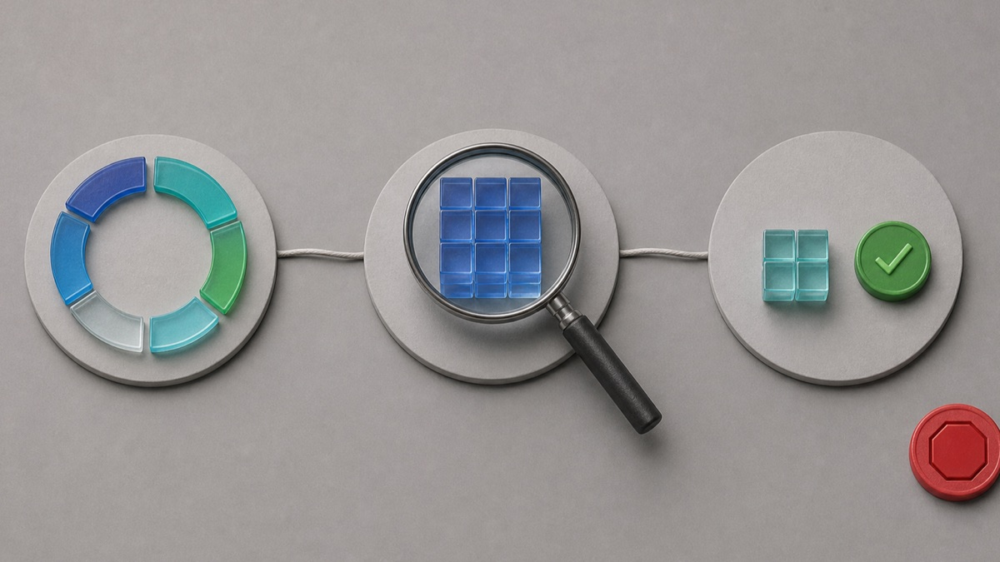

# High Memory Usage in Windows 11: Find the Cause Before You Close Anything

Seeing 80%, 90%, or even 100% memory in Task Manager can be alarming, but the percentage alone does not tell you what is wrong. Windows uses RAM for active apps, background services, and cached data that can make frequently used files faster to reopen. The useful question is not “How do I empty RAM?” It is “Which workload is growing, does the PC actually slow down, and does the pattern return after a clean restart?”

This guide starts with observation, then narrows the cause one reversible step at a time. You will not be asked to delete system files, turn off security, download a “RAM cleaner,” or end unfamiliar Windows processes.

## Applies to / Risk level / Data loss risk / Estimated time / Last checked

| Item | Details |
|---|---|
| Applies to | Windows 11 Home and Pro; most observation steps also work in Windows 10 |
| Risk level | Low |
| Data loss risk | No |
| Estimated time | 20–30 minutes |
| Last checked | 2026-07-31 |

## First decide whether memory use is causing a real problem

High memory use matters most when it comes with a symptom. Look for one or more of these patterns:

- Apps become slow to switch, type, scroll, or reopen.
- The whole PC pauses while the drive activity light stays busy.
- A browser tab, game, meeting app, photo editor, virtual machine, or sync tool becomes less responsive over time.
- The memory percentage rises steadily during the same workload and does not fall after the workload ends.
- One process grows after every refresh in Task Manager.
- The problem starts after every sign-in, even before you open your normal apps.
- You also see crashes, blue screens, corrupted files, or Windows Memory Diagnostic warnings.

If the PC is responsive and the percentage falls after you close a large workload, you may be seeing normal use rather than a fault. Microsoft explains that apps and files are loaded into RAM because it is faster than storage. A PC with less physical memory will reach a high percentage sooner than a PC with more memory while doing the same work.

There is no single “safe” percentage that fits every computer. Installed RAM, open apps, browser tabs, accessibility tools, security software, graphics sharing, and work or school management agents all change the baseline. Use the pattern and the symptoms, not one screenshot.

## Take a two-minute baseline before closing anything

Save open work first. Then open Task Manager with **Ctrl + Shift + Esc**.

1. Select **Processes** and click the **Memory** column so the largest users appear at the top.
2. Wait through several refreshes. Task Manager itself may briefly change the list while it opens.
3. Write down the overall memory percentage and the top five process names.
4. Note whether one recognizable app keeps growing or whether the list stays roughly stable.
5. Select **Performance > Memory** and record the installed memory and available memory. Do not change anything on this page.

This snapshot protects you from a common mistake: ending several processes and then having no idea which one mattered. It also gives you useful details if you later contact the app publisher, PC manufacturer, or Microsoft Support.

Do not end a process just because its name looks unfamiliar. Windows, antivirus, graphics, audio, backup, encryption, cloud sync, and workplace tools can use technical names. Ending the wrong process may interrupt a scan, update, meeting, file transfer, or managed-device policy.

## Restart once and compare the same conditions

Use **Start > Power > Restart**. Do not use Shut down as the comparison step, and do not simply close the laptop lid. After signing in, wait about five minutes without launching your normal workload. Open Task Manager again and take the same snapshot.

Compare three points:

- the idle baseline after restart;
- the point immediately after opening the app or workload that usually triggers the problem; and
- the point five to ten minutes later.

If memory starts low, rises when one known app opens, and falls after you close that app normally, the app or workload is the best place to investigate. If memory is already high immediately after sign-in, startup apps and background services deserve attention. If no process explains the total or memory keeps growing for hours, keep your notes and move to the advanced observation section instead of downloading a cleaner.

## Close only work you recognize

Start with the app’s own Close, Exit, or Quit control. Save documents and wait for uploads or exports to finish. Then watch Task Manager for a minute.

For a browser, close unused windows and heavy tabs in small groups. Video calls, web games, large documents, and many extensions can each add memory. Reopen the browser with only one or two tabs and compare. If usage stays reasonable until one site or extension returns, you have isolated a repeatable trigger without changing Windows.

For a meeting, photo, video, game, or development app, check the publisher’s official update and support pages. Do not assume that a large number is automatically a leak: large projects and virtual machines can legitimately reserve a lot of memory. The warning sign is uncontrolled growth, failure to release memory after the task ends, or repeated crashes under the same conditions.

For cloud sync or backup software, allow active work to finish before closing it. If it repeatedly grows on the same file or folder, record that item and use the vendor’s official support path. Never delete a sync database or backup catalog based on an unverified forum command.

Observe first, isolate one recognizable workload, and verify the result before making another change.

## Reduce startup load one app at a time

If memory is high after every sign-in, review startup apps:

1. Open **Settings > Apps > Startup**.
2. Leave Windows security, touchpad, audio, graphics, backup, encryption, and work-management items alone unless their official support instructions say otherwise.
3. Turn off one optional app you recognize and do not need immediately after sign-in.
4. Restart, wait five minutes, and compare the same Task Manager baseline.
5. Turn the item back on if you lose a feature you need or memory use does not materially change.

Microsoft’s startup-app guidance also shows the same list in Task Manager and explains that Task Manager reports startup impact. Startup impact is not the same as current memory consumption, but it helps identify optional software that launches automatically.

Avoid disabling a dozen items together. A one-at-a-time test is slower, but it is reversible and tells you whether a specific change helped.

## Update through Windows and the app publisher

Check **Settings > Windows Update** and install normal updates offered for your device. Then update the suspected app through its built-in updater, Microsoft Store page, or official publisher site. Restart and reproduce the same workload.

Before blaming an update, check your exact Windows version under **Settings > System > About** or by typing **winver** in Run. Microsoft’s Windows release health and public Windows message center list current known issues and affected versions. As of the last check for this article, those pages did not show a broad Windows 11 advisory saying that all high memory usage is a known operating-system defect. A July 2026 performance issue for a limited set of Dell devices with a specific Intel driver was marked resolved; it should not be used to explain unrelated PCs.

Do not download drivers from search ads, file-sharing sites, or “automatic driver updater” tools. Use Windows Update, the PC manufacturer, or the hardware maker’s official support page.

## Match what you observe to the next safe action

| What you observe | What it suggests | Next safe action |
|---|---|---|
| Memory falls after closing one known app | The workload is the main user | Update or repair that app through its official controls |
| Memory is high only with many browser tabs | The browser workload exceeds available RAM | Close tabs in groups; test extensions through the browser |
| Memory is high immediately after sign-in | Startup software is contributing | Disable one optional startup app and retest |
| One process grows continuously | Possible app fault or leak | Record its name/version and contact the publisher |
| No listed app explains the pressure | Cached, kernel, driver, shared graphics, or service use may be involved | Use advanced observation or professional help |
| Crashes or blue screens accompany the symptom | Possible driver or hardware instability | Stop routine cleanup and run official diagnostics/support |
| The PC is managed by work or school | Management agents may be expected | Contact IT before disabling anything |

## What cached memory and “nothing running” can mean

Task Manager’s process list is not a simple receipt where every visible row must add exactly to the headline percentage. Windows also manages cached data, the kernel, drivers, memory compression, shared graphics memory, and system services. Some cached memory can be reclaimed when apps need it, so “used” does not always mean permanently unavailable.

That is why a cleaner that promises to “free RAM” can make a graph look lower without fixing the cause. The tool may simply force useful cached data out of memory, after which Windows has to read it from slower storage again. A temporarily lower number is not the same as a faster or more stable PC.

If Task Manager shows high usage while no large app is obvious, record the installed and available memory, the top processes, when the rise begins, and whether it survives a restart. That evidence is more useful than repeatedly forcing memory to clear.

## Advanced Fixes: use diagnostic tools only after the baseline tests

Back up important files before advanced troubleshooting. These steps are for a persistent, reproducible problem that survived the safe checks.

### Clean boot for a background-software conflict

Microsoft’s clean-boot procedure starts Windows with essential drivers and selected startup services so you can isolate a conflict. It requires administrator access and can temporarily remove functionality. Microsoft also warns that incorrect System Configuration changes can make a computer unusable.

Use the official clean-boot page, keep a record of every disabled item, and restore normal startup when testing is complete. Do not change advanced boot options. On a company or school PC, stop and ask IT.

### RAMMap for an unexplained allocation

RAMMap is an official Microsoft Sysinternals tool that shows how physical memory is allocated across processes, file cache, kernel, drivers, and other categories. It is an analysis tool, not a one-click repair button.

Use RAMMap only from the official Microsoft Learn/Sysinternals page. Save screenshots or a memory snapshot for an experienced helper, but do not clear lists or change system behavior just to reduce a number. If the categories are unfamiliar, collect the evidence and stop.

### Windows Memory Diagnostic for crashes or hardware signs

High usage by itself does not prove bad RAM. Use Windows Memory Diagnostic when the problem also includes blue screens, corrupted data, repeated app crashes, or a Microsoft/device-maker support path asks for it. Save all work first because the test restarts the PC. Microsoft documents how to run the test and review its result in Event Viewer.

Do not open the case, reseat memory, change BIOS/UEFI settings, or buy replacement RAM based only on one high percentage.

## When to stop and get help

- Memory use keeps increasing until apps crash after every restart.
- Blue screens, corrupted files, missing files, or Windows Memory Diagnostic errors appear.
- The PC cannot boot normally or BitLocker asks for a recovery key.
- A process looks suspicious and Windows Security or another trusted security product reports a threat.
- The issue started after a firmware or hardware change.
- The computer is managed by work or school.
- Official clean-boot testing points to a service you do not understand.
- The PC has very little installed RAM for the workload and the manufacturer must confirm whether an upgrade is supported.

Bring your baseline notes, screenshots, Windows version, installed RAM, affected app version, and the exact time the growth starts. That turns “memory is high” into a reproducible support case.

## FAQ

### Is 80% memory usage bad in Windows 11?

Not by itself. If the PC remains responsive and usage falls after a large workload closes, the percentage may be expected for the installed RAM. Investigate sustained growth, slowdowns, crashes, or very low available memory.

### Why is memory high when no apps are open?

Startup apps, services, security tools, drivers, shared graphics, memory compression, and cached data can all use memory. Take a post-restart baseline and review startup apps one at a time.

### Should I end the process using the most memory?

Only if it is an app you recognize, your work is saved, and you can close it normally first. Do not end unfamiliar Windows, security, driver, backup, encryption, or management processes.

### Do RAM cleaner apps fix high memory usage?

They do not identify the cause. Forcing cached data out of RAM may lower the displayed number temporarily and can make Windows reload data from storage. Avoid unknown cleanup and repair software.

### Can a Windows update cause high memory usage?

A specific update or driver issue can affect some devices, but timing alone is not proof. Check your exact Windows version and Microsoft release health, then compare the behavior after current official updates.

### Will adding more RAM fix the problem?

More RAM can help when a legitimate workload exceeds the installed capacity, but it will not repair an app that grows without limit or a faulty driver. Confirm the cause and check the PC maker’s supported upgrade options first.

### When should I run Windows Memory Diagnostic?

Use it when high usage comes with blue screens, crashes, corrupted data, or other hardware signs—not simply because Task Manager shows a large percentage. Save work because the test restarts the PC.

### Is RAMMap safe for beginners?

It is a legitimate Microsoft Sysinternals analysis tool, but its categories are advanced. Use it to collect evidence from the official download, not to apply random “clear memory” instructions.

## Related Guides

- [High CPU Usage Windows 11: A Low-Risk Windows Diagnostic Path](https://easypcfixguide.blogspot.com/2026/07/high-cpu-usage-windows-11-low-risk.html)
- [High Disk Usage Windows 11: A Low-Risk Windows Diagnostic Path](https://easypcfixguide.blogspot.com/2026/07/high-disk-usage-windows-11-low-risk.html)
- [Check Your Windows Version, Build, Edition, and System Type](https://easypcfixguide.blogspot.com/2026/06/how-to-check-your-windows-version.html)
- [Startup Apps Slowing Down Your PC: Find and Disable Them Safely](https://easypcfixguide.blogspot.com/2026/07/startup-apps-slowing-down-your-pc.html)

## Official sources

- [Tips to improve PC performance in Windows](https://support.microsoft.com/en-us/windows/experience/performance-optimization/tips-to-improve-pc-performance-in-windows)
- [Configure startup applications in Windows](https://support.microsoft.com/en-us/windows/experience/startup-boot/configure-startup-applications-in-windows)
- [How to perform a clean boot in Windows](https://support.microsoft.com/en-us/windows/experience/startup-boot/how-to-perform-a-clean-boot-in-windows)
- [RAMMap — Microsoft Sysinternals](https://learn.microsoft.com/en-us/sysinternals/downloads/rammap)
- [All about computer memory](https://support.microsoft.com/en-us/windows/experience/compatibility/all-about-computer-memory)
- [Windows release health](https://learn.microsoft.com/en-us/windows/release-health/)
- [Windows message center](https://learn.microsoft.com/en-us/windows/release-health/windows-message-center)
- [Windows 11, version 25H2 known issues and notifications](https://learn.microsoft.com/en-us/windows/release-health/status-windows-11-25H2)
- [Microsoft Support: Windows Memory Diagnostic guidance](https://support.microsoft.com/en-us/windows/experience/performance-optimization/how-to-fix-error-0xa-irql-not-less-or-equal)

## Final checklist

Measure before changing. Compare a clean restart, the triggering workload, and the same workload several minutes later. Close only apps you recognize, reduce startup load one item at a time, and update through official channels. Use clean boot, RAMMap, or hardware diagnostics only when the safe observations point there. A useful diagnosis explains the growth pattern; it does not merely make the percentage smaller.
