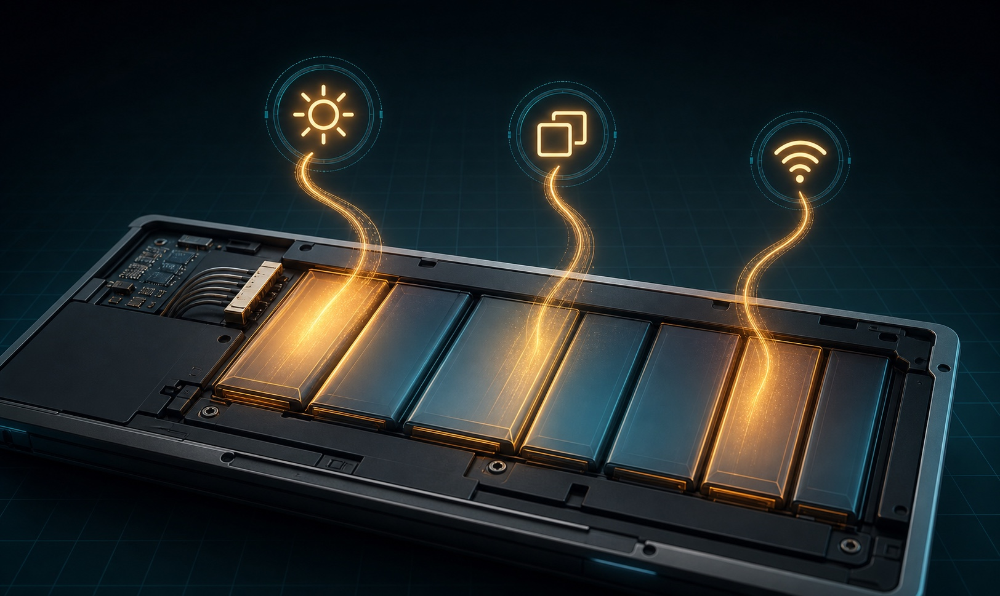
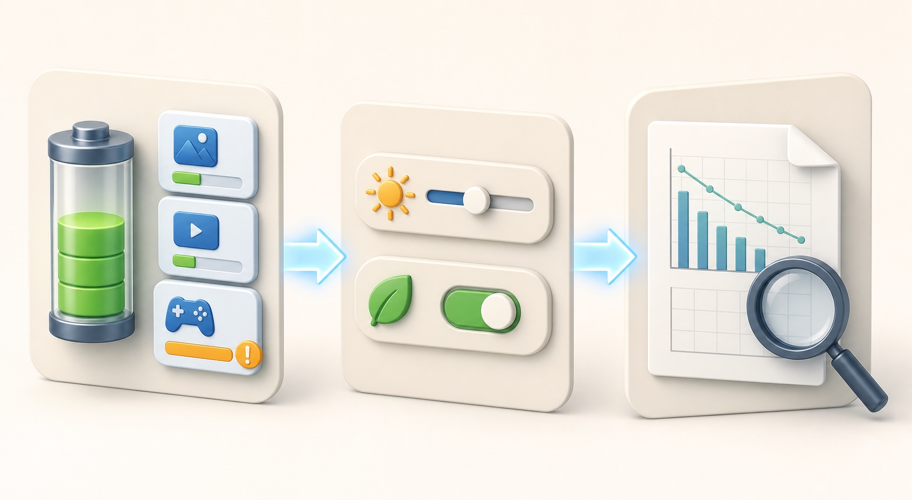

# Laptop Battery Draining Fast in Windows 11: Find the Cause Safely

A Windows 11 laptop that suddenly lasts two hours instead of six does not automatically need a new battery. A bright screen, a busy app, a USB device, poor sleep behavior, or an update-specific problem can all increase power use. An older battery can also hold much less energy than it did when new. The safe approach is to separate **high power use** from **low battery capacity** before changing drivers or buying parts.

This guide starts with measurements already built into Windows. You will compare a normal battery session, identify the apps using power, apply reversible energy settings, and then check the battery report. No third-party repair or driver utility is required.

## Quick answer

- If the drain happens only while gaming, video editing, using maximum brightness, or running many browser tabs, the battery may be healthy but the workload is demanding.
- If one app dominates **Settings > System > Power & battery > Battery usage**, update, close, or restrict that app before changing Windows globally.
- If the laptop loses a large percentage while sleeping, disconnect docks and USB devices, restart once, and compare another sleep period.
- If the battery report shows that **Full charge capacity** is far below **Design capacity**, shorter runtime is probably related to battery wear.
- If the case is bulging, the trackpad is lifting, or the battery smells unusual or feels dangerously hot, stop using and charging the laptop and contact the manufacturer.
- If the drain began immediately after an update, check Microsoft Windows release health, the Windows message center, and the device maker's support page for your exact model before forcing another update or rollback.

## Applies to / Risk level / Data loss risk / Estimated time / Last checked

| Item | Details |
|---|---|
| Applies to | Windows 11 laptops; menu names can vary by version and manufacturer |
| Risk level | Low |
| Data loss risk | No |
| Estimated time | 30-60 minutes plus one comparison battery session |
| Last checked | 2026-08-02 |

## Before you start

Save open work and keep the correct charger nearby, but perform the comparison test on battery power. Write down the starting percentage, time, screen brightness, and what apps you use. A single unexplained percentage drop is not enough to diagnose the cause because Windows estimates can move after a restart or a change in workload.

Use the laptop on a hard, ventilated surface. Heat increases fan activity and may make an aging lithium-ion battery deteriorate faster. Do not cover vents with bedding. Disconnect accessories that are not needed for the test, especially a dock, external drive, phone, USB receiver, or portable monitor.

Do not download a “battery optimizer,” automatic driver updater, or unknown repair utility, and never weaken Windows licensing or security protections. These tools cannot restore the chemical capacity of an old battery and may change unrelated settings. Use Windows, Microsoft, and the laptop maker's official support tools only.

## Symptoms to record before changing settings

- The percentage falls quickly only during one app, game, meeting, or browser session.
- The laptop becomes warm and the fans stay active during light work.
- Battery loss is greatest while the lid is closed or the computer is supposed to be sleeping.
- Runtime became much shorter immediately after a Windows, graphics, firmware, or app update.
- The battery reaches a low percentage suddenly or the estimate jumps instead of declining steadily.
- The laptop shuts down even though Windows still showed charge remaining.
- Runtime is short in every workload, including a simple local document with low brightness.
- The chassis no longer sits flat, the trackpad is raised, or a gap appears around the bottom cover.

Record whether the change is **new**, **gradual**, or **workload-specific**. New drain points toward software, an update, sleep behavior, or a connected device. Gradual decline across months is more consistent with normal battery wear. A demanding workload is not a fault by itself.

## What fast battery drain can mean

There are two different problems that feel the same to the user:

1. **The laptop is using energy too quickly.** High display brightness, a busy CPU or GPU, background synchronization, wireless radios, an external device, or an app that prevents sleep can raise consumption.
2. **The battery stores less energy than before.** Lithium-ion cells lose capacity with age and charge cycles. Even normal power use produces shorter runtime when full charge capacity has fallen.

The Windows Battery usage page helps with the first problem. The battery report helps with the second. You need both views before deciding that the battery or Windows is at fault.

The safest order is to measure app use, apply reversible power settings, and then compare battery capacity and recent usage.

## Step-by-step fixes: measure first, then reduce drain

### 1. Create one fair comparison session

Charge the laptop, restart it, unplug it, and note the percentage and time. Set a usable but moderate brightness. Then do one ordinary task for 30 to 60 minutes, such as reading, writing, or using a few browser tabs. Avoid a game or system update during this baseline.

At the end, record the remaining percentage, warmth, fan activity, and the apps you used. Repeat later with one suspected app closed. Comparing two similar sessions is more useful than watching the battery estimate change minute by minute.

### 2. Check Battery usage by app

Open **Start > Settings > System > Power & battery > Battery usage**. Choose a recent period that includes the bad session. Look at both total use and background use.

- If one app is much higher than expected, close it fully and repeat the comparison.
- Update the app from its official store or vendor.
- For apps that expose a background-permission control, select **Settings > Apps > Installed apps > the app > Advanced options** and choose a less active background setting.
- Do not disable an unfamiliar Windows process merely because it appears in Task Manager. Search the exact name on Microsoft Support or ask the device administrator first.

Video calls, games, 3D work, virtual machines, and browser video legitimately use more energy. The useful question is whether the consumption matches what you were doing.

### 3. Apply Windows Energy recommendations selectively

Open **Settings > System > Power & battery > Energy recommendations**. Microsoft notes that available recommendations vary by hardware and sensors, so a missing option is not an error.

Start with reversible changes:

- Choose a more efficient power mode for battery use.
- Reduce built-in display brightness to the lowest comfortable level.
- Set the screen to turn off sooner when the laptop is idle.
- Set a reasonable sleep timeout.
- Stop USB devices when the screen is off if that recommendation appears.
- Disable an animated screen saver; allowing the display to turn off uses less power.

Apply one group of changes, test, and keep only settings that fit your work. A very short sleep timeout may be inconvenient during presentations, while a lower refresh rate can make motion feel less smooth.

### 4. Turn on Energy saver

In **Settings > System > Power & battery**, expand **Energy saver**. Set it to turn on automatically at a battery level that gives you useful warning time. You can also enable it temporarily for the current session.

Energy saver limits some background activity and can dim the screen. That may delay synchronization or reduce performance, which is expected. It is a diagnostic clue: if runtime improves substantially with Energy saver, active processes or display settings are likely important contributors.

### 5. Check the display and connected devices

The display is often a major power user. Lower brightness, and under **Settings > System > Display > Advanced display**, test a lower refresh rate if Windows offers one. For a demanding app, **Settings > System > Display > Graphics** may offer a power-saving GPU preference.

Disconnect unused USB storage, capture devices, phones, hubs, and portable displays during the test. Turn off Bluetooth only if you are not using a Bluetooth mouse, keyboard, headset, or accessibility device. Airplane mode is useful only for an offline comparison; it is not a permanent fix when you need Wi-Fi.

### 6. Separate active drain from sleep drain

Charge the laptop, note the percentage, close apps, disconnect accessories, and put it to sleep for a defined period. Record the percentage when it wakes. Repeat once after a full restart.

If the laptop is hot, the fans are running, or the percentage falls heavily while the lid is closed, an app, driver, dock, or device may be preventing low-power sleep. Check the manufacturer's support page for the exact model. Do not change BIOS settings or force a different sleep state from an unverified forum guide.

### 7. Check Windows and device-maker notices

Use **Settings > Windows Update > Update history** to record the most recent update and its date. Then check Microsoft **Windows release health** and **Windows message center** for current known issues. Check the laptop maker's support page using the exact model or service identifier.

This matters in August 2026 because Microsoft reported that the July 2026 Windows security update was temporarily unavailable for a limited number of Dell devices with Intel processors due to an incompatibility that could cause shutdowns, poor performance, heat, and battery drain. That does not mean every Dell or Intel laptop has this issue. It means model-specific official notices should be checked before assuming the battery is worn out or forcing the update.

Install firmware and drivers only from Windows Update or the manufacturer's official page for your exact model. Do not install a random battery or chipset driver package from a download site.

### 8. Restart and retest after updates finish

If Windows Update is actively downloading, installing, indexing, or optimizing after a feature update, temporary CPU and disk activity can increase drain. Let the update finish while connected to power, restart once, and run the fair comparison session again.

Do not repeatedly uninstall and reinstall updates. If an official known-issue page identifies your model, follow that page or the manufacturer rather than a generic rollback video.

## Advanced Fixes: generate and read the battery report

Back up important files before advanced fixes. The report itself is read-only, but it uses an elevated command window. Do not run commands you do not understand. Copy commands only from official Microsoft documentation and type only the single command shown below.

1. Open Start, type **Command Prompt**, right-click it, and select **Run as administrator**.
2. Enter `powercfg /batteryreport` and press Enter.
3. Windows displays the path of the saved HTML report. Open that file in your browser.
4. Read **Installed batteries**, **Recent usage**, **Battery usage**, and **Battery life estimates**.

Compare **Design capacity** with **Full charge capacity**. Full charge capacity normally becomes lower as a lithium-ion battery ages. Do not treat one percentage threshold from a forum as a universal replacement rule; laptop makers use different diagnostics, warranty thresholds, and charge-management modes.

Use **Recent usage** to look for unexpected active periods and **Battery usage** to compare drain across time. If the report contains gaps or estimates that do not match reality, repeat a normal session before drawing a conclusion.

Microsoft Learn also documents `powercfg /energy`, which analyzes common energy-efficiency problems, and `powercfg /sleepstudy` for Modern Standby diagnostics. These are advanced tools. Use them only when the Microsoft documentation applies to your device or a support technician asks for them; do not paste additional switches from community posts.

## Battery health, smart charging, and normal wear

Microsoft explains that lithium-ion batteries lose capacity with time and use. Smart charging, when supported by the device maker, may intentionally stop charging below 100% to reduce long-term wear. A heart symbol near the battery icon can indicate Smart charging. Do not disable it just because the laptop does not remain at 100%.

For everyday care, avoid frequent deep discharges and excessive heat. Microsoft suggests keeping the charge in a moderate range, roughly 20% to 80%, when practical. This is a longevity guideline, not a requirement that should interrupt urgent work. The manufacturer's own charging mode may manage the range automatically.

If the battery report shows a large capacity loss and the maker's official hardware test also reports poor health, settings can reduce consumption but cannot restore the missing chemical capacity. Replacement by the manufacturer or a qualified repair provider becomes the appropriate fix.

## When to stop and get help

- Stop using and charging the laptop if the battery or chassis is swollen, the trackpad lifts, the case separates, or there is an unusual chemical smell.
- Shut down and disconnect power if the laptop becomes dangerously hot during light use; do not puncture, press, or try to flatten a swollen battery.
- Contact the manufacturer if the laptop shuts down on battery despite a meaningful charge, the battery is not detected, or the official hardware diagnostic returns a battery error.
- Get help before opening the case. Many internal batteries require model-specific disassembly and safe disposal.
- Ask the work or school administrator before changing power, update, firmware, or device-management settings on a managed PC.
- Stop if BitLocker recovery appears, Windows repeatedly blue-screens, or an official update page says your model is under a safeguard hold.
- Use a qualified service provider when the correct charger, a normal workload, and official diagnostics still show unsafe heat or extremely short runtime.

## FAQ

### Why did my Windows 11 battery life change suddenly?

A new app, background synchronization, display brightness, a dock, sleep behavior, or an update can change power use. Check Battery usage and the timing before blaming battery wear.

### Is it normal for gaming to drain the battery quickly?

Yes. Games can use the CPU, GPU, display, and cooling system heavily. Compare runtime during light work. A laptop designed for gaming may still have short battery life under load even when the battery is healthy.

### Should I end every high-usage process in Task Manager?

No. Some Windows and security processes are necessary. Close only apps you recognize, and verify unfamiliar process names through Microsoft or your device administrator.

### Does keeping the laptop at 100% damage the battery?

Long periods at full charge and high temperature can accelerate wear. If your laptop supports Smart charging or a manufacturer charge limit, use that feature rather than micromanaging the plug.

### Why does my laptop stop charging below 100%?

Smart charging or a manufacturer battery-health mode may intentionally limit the charge. Check the battery icon and the official manual for your exact model before changing the setting.

### Can a Windows update cause battery drain?

Temporary activity after an update can use more power, and specific update or device compatibility issues can occur. Check release health, the message center, update history, and your manufacturer's notice instead of assuming every update is the cause.

### Is `powercfg /batteryreport` safe?

It generates an HTML report and does not repair or reset the battery. Use the exact command from Microsoft documentation, and do not add commands you do not understand.

### When should I replace the battery?

Consider service when full charge capacity has fallen substantially, the maker's diagnostic reports poor health, runtime remains unusably short after software causes are excluded, or the battery is physically unsafe. A swelling battery requires immediate professional handling.

### Will a driver updater improve battery life?

Do not use random driver tools. Use Windows Update and your laptop maker's exact model page. Incorrect firmware or chipset drivers can create more problems than they solve.

## Related Guides

- [Check Your Windows Version, Build, Edition, and System Type](https://easypcfixguide.blogspot.com/2026/06/how-to-check-your-windows-version.html)
- [High CPU Usage in Windows 11: Find the Cause Safely](https://easypcfixguide.blogspot.com/2026/07/high-cpu-usage-windows-11-low-risk.html)
- [High Memory Usage in Windows 11: Find the Cause Before You Close Anything](https://easypcfixguide.blogspot.com/2026/07/high-memory-usage-in-windows-11-find.html)
- [Windows 11 Slow After an Update: Measure the Bottleneck First](https://easypcfixguide.blogspot.com/2026/07/windows-11-slow-after-update-measure.html)

## Microsoft and manufacturer sources

- [Microsoft Support: Caring for your battery in Windows](https://support.microsoft.com/en-us/windows/experience/power-battery/caring-for-your-battery-in-windows)
- [Microsoft Support: Learn more about Energy recommendations](https://support.microsoft.com/en-us/windows/experience/power-battery/learn-more-about-energy-recommendations)
- [Microsoft Support: Battery saving tips for Windows](https://support.microsoft.com/en-US/Windows/Experience/Power-Battery/battery-saving-tips-for-windows)
- [Microsoft Learn: Powercfg command-line options](https://learn.microsoft.com/en-us/windows-hardware/design/device-experiences/powercfg-command-line-options)
- [Microsoft Support: Use Smart charging in Windows](https://support.microsoft.com/en-us/windows/experience/power-battery/use-smart-charging-in-windows)
- [Microsoft Learn: Windows release health](https://learn.microsoft.com/en-us/windows/release-health/)
- [Microsoft Learn: Windows message center](https://learn.microsoft.com/en-us/windows/release-health/windows-message-center)
- [Dell Support: The battery is draining quicker than expected](https://www.dell.com/support/kbdoc/en-us/000143524/the-battery-drains-quicker-than-expected-on-a-dell-notebook-with-modern-standby-mode-enabled)

## Final summary

Fast battery drain in Windows 11 is best diagnosed as a comparison, not a guess. Measure one normal session, inspect Battery usage, apply reversible Energy recommendations, separate active drain from sleep drain, and then read the battery report. Check current Microsoft and manufacturer notices when the problem began after an update. Software settings can reduce unnecessary consumption, but they cannot restore worn battery capacity. Stop immediately for swelling, dangerous heat, case separation, or a manufacturer diagnostic error.
