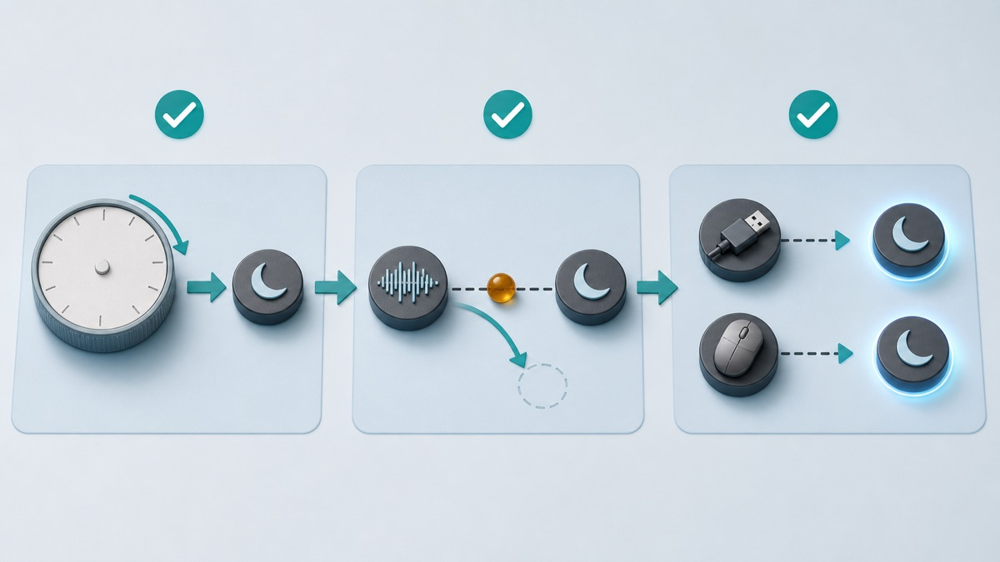

# Windows 11 Sleep Mode Not Working: Find What Is Blocking It

*A quiet diagnostic metaphor: Windows can enter sleep only after settings, apps, and devices stop keeping the system active.*

If your Windows 11 PC will not sleep, first identify which failure you actually have: the automatic timer never acts, manual Sleep returns to the desktop, the PC sleeps and wakes immediately, or the Sleep choice is missing. Save your work, restart once, test manual Sleep with accessories disconnected, then check settings before changing a driver or power policy.

## Quick Answer

- Test **Start > Power > Sleep** before blaming the timer. A manual failure and an idle-timer failure are different problems.
- Close active calls, music, video, games, and file transfers. These activities can legitimately ask Windows to remain awake.
- Temporarily disconnect nonessential USB devices and external docks, then test again.
- Confirm the screen-off and sleep timers under **Settings > System > Power & battery**.
- If the PC sleeps and wakes immediately, look for the last wake source instead of lengthening the timer.
- Use built-in `powercfg` reports only in the Advanced Fixes section below. Read the result before changing anything.

## Applies to / Risk level / Data loss risk / Estimated time / Last checked

| Item | Details |
| --- | --- |
| Applies to | Windows 11 Home and Pro; menu names and available sleep states vary by PC hardware |
| Risk level | Low |
| Data loss risk | No |
| Estimated time | 20-40 minutes, including two controlled sleep tests |
| Last checked | 2026-08-04 |

## Identify the Exact Sleep Failure

- The display turns off after the chosen time, but fans, lights, or audio show that the PC is still awake.
- The automatic sleep timer never acts even when the keyboard and mouse are untouched.
- Selecting Sleep makes the screen go dark briefly, then the desktop returns.
- The PC enters sleep normally but wakes again within seconds or minutes.
- The Sleep option is missing from the Power menu.
- Closing a laptop lid turns off the display but does not produce the expected sleep behavior.
- The problem began after connecting a dock, controller, network adapter, display, or other accessory.
- The problem began after a Windows, driver, firmware, or application update.

## Why Screen Off Is Not Always Sleep

A black display does not prove the whole PC is asleep. Microsoft documents both traditional sleep states and Modern Standby. A traditional system can use an S3 sleep state, while a Modern Standby PC uses an S0 low-power idle model. On Modern Standby, the screen-off period can include short background activity before and during the lower-power phase. That behavior can look different from an older laptop even when it is working correctly.

Windows also honors power requests from apps and drivers. A media session, active call, file transfer, display driver, or connected device may ask the system not to turn off the display or enter low power. A different device or timer may wake a PC that successfully went to sleep. This is why a controlled test and an observation are safer than changing several power settings at once.

| Observation | Most useful next test |
| --- | --- |
| Manual Sleep works, but the idle timer does not | Check the timer, active media or calls, and known apps that may keep the system busy. |
| Manual Sleep immediately returns to the desktop | Disconnect nonessential accessories, restart, and inspect a wake source or power request. |
| The PC sleeps, then wakes later | Record the wake time and check the last wake source and active wake timers. |
| Sleep is absent from the Power menu | Check which sleep states the hardware reports and use the PC maker's support page. |

## Prepare a Clean, Reversible Test

1. Save every open document. Sleep troubleshooting should not cost unsaved work if the PC restarts unexpectedly.
2. Write down whether the problem happens on battery, while plugged in, or both.
3. Pause any large download, cloud sync, backup, game installation, call, video, or music playback.
4. Disconnect nonessential USB devices, external storage, controllers, hubs, and docks. Keep the keyboard and mouse you need.
5. Note the current time and whether the screen, fans, case lights, and connected displays turn off.
6. Restart Windows once. Use Restart from the Power menu rather than closing and reopening the lid.

**Testing rule:** change one condition, test Sleep, and record the result. Reconnect accessories one at a time only after the basic test works.

## Step 1: Compare Manual Sleep with the Automatic Timer

1. After the restart, wait until the desktop is fully settled and no installation is running.
2. Select **Start > Power > Sleep**. Do not move the mouse or press a key during the test.
3. Wait about one minute. Note whether only the display turns off, whether the PC appears to sleep, or whether it wakes immediately.
4. Wake it with the power button or the method documented by the PC maker. Different systems support different wake inputs.
5. If manual Sleep works, test the idle timer next. Open **Settings > System > Power & battery** and expand the screen, sleep, and hibernate timeout controls available on your device.
6. Choose a short temporary sleep time for the current power condition, leave the PC untouched, and observe it. Restore your preferred value after the test.
7. If the display turns off but the system does not sleep, make sure you changed the sleep timeout, not only the screen timeout.
8. If a work or school policy locks the setting, stop and contact the administrator instead of trying to bypass it.

## Step 2: Check the Lid and Power-Button Action

1. Search Windows for **Control Panel**, open **System and Security**, then open **Power Options**.
2. Select **Choose what the power buttons do**. On a laptop, also review the lid-close action.
3. Compare the **On battery** and **Plugged in** columns. They can be intentionally different.
4. Set the action you actually want, save it, and run one controlled test.
5. Do not assume a closed lid means Sleep. It can be configured to do nothing, especially when a laptop is used with an external display or dock.
6. If the setting is unavailable or managed, use the device maker's documentation or your administrator's policy.

## Step 3: Isolate an App or Accessory

1. Repeat manual Sleep with nonessential accessories still disconnected.
2. If it now works, reconnect one device, wait for Windows to recognize it, and test again.
3. If the timer fails only while one known app is open, close that app normally and retest. Media playback and calls can intentionally keep a system awake.
4. Check the app's official settings for an option related to keeping the PC awake. Do not install an extra “sleep fixer.”
5. If one dock, network adapter, controller, or USB device changes the result, record its exact model and obtain guidance from the PC or device maker.
6. Do not disable every device at once. That removes evidence and can also disable input, networking, accessibility, or security features you need.

*Follow one evidence path at a time: confirm the timer, remove active app requests, then reconnect devices individually.*

## Step 4: Update from Trusted Sources

1. Open **Settings > Windows Update** and check for normal Windows updates.
2. Review optional driver updates carefully. Install only a driver that matches your device and symptom.
3. For a laptop, desktop, motherboard, dock, or graphics device, use the manufacturer's official support page for your exact model.
4. Restart when the official installer or Windows asks, then repeat the same controlled sleep test.
5. Never use a random driver updater, unknown repair software, or an unofficial firmware package.
6. If the symptom started immediately after an update, note the update date and Windows version before taking any recovery action.

Windows release health and the Windows message center are the right places to check version-specific update problems. At this article's last check, Microsoft maintained separate current pages for Windows 11 versions 26H1, 25H2, and 24H2. Do not assume every sleep problem is a Windows-wide incident: compare your version, update date, device model, and the issue description. A message-center item about a narrow device or driver does not prove that an unrelated PC has the same cause.

## Advanced Fixes: Read the Evidence Before You Change Power Rules

Back up important files before advanced fixes. Save your work, use an administrator account only when required, do not run commands you do not understand, and copy commands only from official Microsoft documentation. Read-only reports come first. Do not create power-request overrides, edit the Registry, change BIOS/UEFI sleep modes, or flash firmware as a guess.

### Check available sleep states and active requests

1. Open **Terminal (Admin)** only if Windows says administrator access is required.
2. Run `powercfg /a`. Microsoft says this reports which sleep states are available and may explain why a state is unavailable.
3. Run `powercfg /requests`. It lists current app and driver power requests that can prevent the display from turning off or the PC from entering low-power sleep.
4. Record the exact process, service, or driver name. Close a recognized app normally and retest before changing any system rule.
5. Do not use `powercfg /requestsoverride` just to make the list empty. An override can hide a legitimate request, such as active audio, display use, or a device operation.

### Check why the PC woke

1. After an unwanted wake, run `powercfg /lastwake` and record what Windows reports.
2. Run `powercfg /waketimers` to list active wake timers.
3. Run `powercfg /devicequery wake_armed` to list devices currently allowed to wake the system.
4. Do not disable wake for the keyboard, network adapter, or another device until you understand how you expect to wake or remotely manage the PC.

### Generate a sleep report when the simple checks are inconclusive

Microsoft documents `powercfg /systemsleepdiagnostics` as an administrator report showing recent intervals when the user was away and whether the system slept. On a Modern Standby PC, `powercfg /sleepstudy` creates an HTML report with Screen Off and Sleep segments, active time, power use, and top activity sources. SleepStudy is not a generic repair button and may not apply to a traditional S3 system. Keep the report for a device maker or support technician rather than changing a setting you cannot reverse.

Microsoft also states that switching between traditional S3 and Modern Standby is not a normal Windows setting change. Do not follow instructions that promise to force a different hardware sleep model with a Registry edit or an unsupported firmware change.

## When to Stop and Get Help

- The PC crashes, shows a blue screen, or restarts instead of sleeping.
- BitLocker recovery appears, a drive disappears, files become unreadable, or storage makes unusual noises.
- The PC becomes unusually hot, the battery swells, or a burning smell or electrical noise is present.
- The Sleep option is missing and `powercfg /a` reports a hardware or firmware limitation you do not understand.
- The problem affects a work or school PC with managed power policy, encryption, VPN, or remote-management requirements.
- The issue began with a firmware update, motherboard change, or repair that requires model-specific support.
- A requested fix involves an unsupported sleep-state conversion, Registry editing, firmware flashing, or disabling security.
- Three controlled tests produce inconsistent results and you cannot identify whether the cause is an app, device, update, or hardware fault.

## FAQ

### Why does my screen turn off but the PC stay awake?

Screen timeout and system sleep timeout are separate. On Modern Standby hardware, a screen-off session can also contain limited background activity before or during the low-power phase.

### Why does Windows 11 wake immediately after I choose Sleep?

A device, wake timer, or other wake source may trigger it. Test with nonessential accessories disconnected, then use the read-only last-wake and wake-timer reports in Advanced Fixes.

### Can a browser, game, or media app block sleep?

Yes. Microsoft documents power requests that apps and drivers can use to keep the display on or prevent low-power sleep. Close the app normally and verify with a controlled test.

### Should I disable every device that can wake the PC?

No. You might disable the keyboard, remote management, networking, or accessibility behavior you need. Identify one source and confirm the device maker's guidance first.

### Is Modern Standby the same as traditional S3 sleep?

No. Modern Standby uses an S0 low-power idle model, while traditional sleep commonly uses S3. The supported model is determined by the hardware design; it is not a beginner toggle.

### Does disabling Fast Startup fix sleep mode?

Fast Startup affects shutdown and startup, not every sleep failure. Do not change it as a universal first fix. Diagnose manual sleep, timers, requests, and wake sources first.

### Should I update the BIOS or firmware?

Not as a guess. Firmware changes can be high risk if interrupted or mismatched. Use the exact PC maker's official instructions or ask its support team after simpler evidence points there.

### Is hibernate a safe alternative?

Microsoft says hibernate uses less power than sleep and restores your session more slowly, but it is not available on every PC. It can be a temporary option while you investigate, not proof that the sleep problem is fixed.

### Should I reset or reinstall Windows?

No, not for an unexplained sleep problem before controlled tests and official diagnostics. Recovery actions are broader and can affect apps, settings, or data; use them only with a backup and a clearly supported reason.

### How do I tell support what happened?

Provide the PC model, Windows version, whether it happens on battery or AC power, the exact test time, connected devices, recent changes, and the relevant `powercfg` report result.

## Related Guides

- [Laptop Battery Draining Fast in Windows 11: Find the Cause Safely](https://easypcfixguide.blogspot.com/2026/08/laptop-battery-draining-fast-in-windows.html)
- [Windows 11 Slow After Update? Measure the Bottleneck Before Changing Settings](https://easypcfixguide.blogspot.com/2026/07/windows-11-slow-after-update-measure.html)
- [USB Device Not Recognized in Windows 11: Identify the Port, Cable, or Driver Boundary](https://easypcfixguide.blogspot.com/2026/07/usb-device-not-recognized-in-windows-11.html)
- [Check Your Windows Version, Build, Edition, and System Type](https://easypcfixguide.blogspot.com/2026/06/how-to-check-your-windows-version.html)

## Microsoft Sources

- [Shut down, sleep, or hibernate your PC](https://support.microsoft.com/en-US/Windows/Experience/Power-Battery/shut-down-sleep-or-hibernate-your-pc)
- [Change the power mode for your Windows PC](https://support.microsoft.com/en-us/windows/change-the-power-mode-for-your-windows-pc-c2aff038-22c9-f46d-5ca0-78696fdf2de8)
- [Powercfg command-line options](https://learn.microsoft.com/en-us/windows-hardware/design/device-experiences/powercfg-command-line-options)
- [System sleeping states](https://learn.microsoft.com/en-us/windows-hardware/drivers/kernel/system-sleeping-states)
- [Modern Standby states](https://learn.microsoft.com/en-us/windows-hardware/design/device-experiences/modern-standby-states)
- [Modern Standby SleepStudy](https://learn.microsoft.com/en-us/windows-hardware/design/device-experiences/modern-standby-sleepstudy)
- [Windows release health](https://learn.microsoft.com/en-us/windows/release-health/)
- [Windows message center](https://learn.microsoft.com/en-us/windows/release-health/windows-message-center)

## Final Summary

When Windows 11 sleep mode is not working, separate a timer problem from a failed sleep transition, an unwanted wake, or a missing hardware sleep state. Start with saved work, one restart, a manual Sleep test, correct timers, and disconnected accessories. Update only through Windows or the device maker. If the cause remains unclear, use Microsoft’s read-only `powercfg` reports to identify requests, supported states, and wake sources before changing anything. Stop when the evidence points to managed policy, firmware, hardware, encryption, crashes, or storage trouble.
