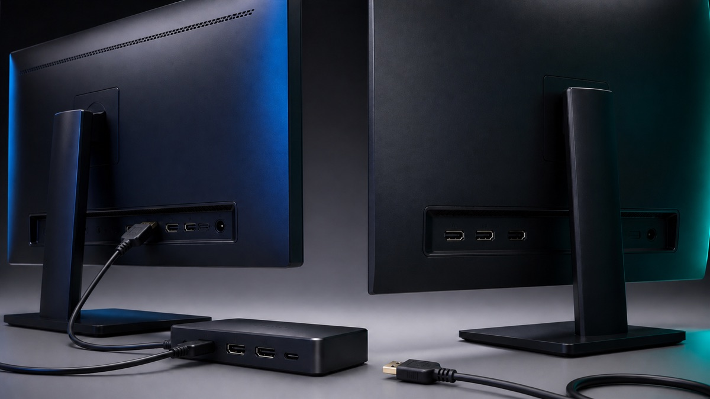
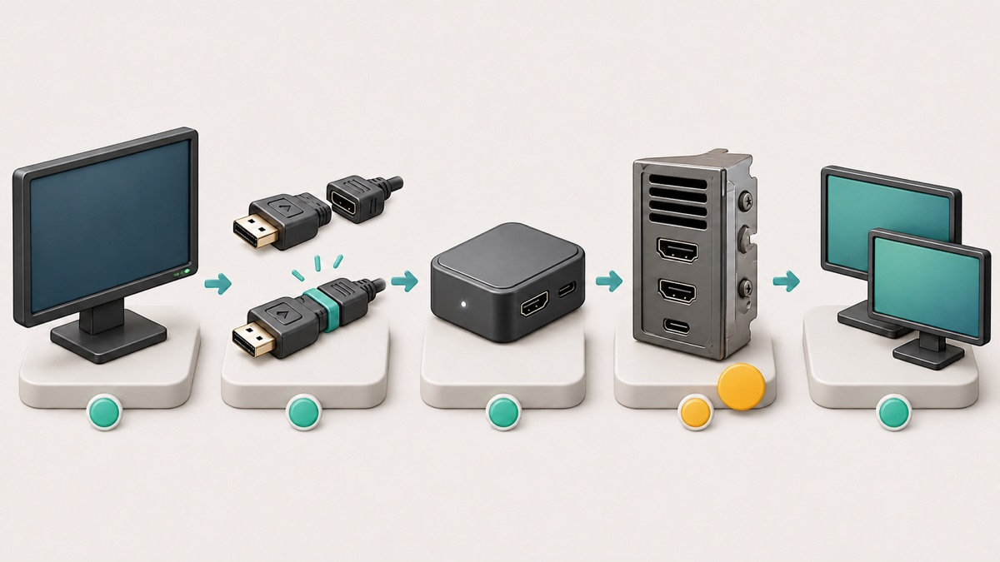

# Second Monitor Not Detected in Windows 11: Check the Signal Path First

When Windows 11 cannot see a second monitor, do not begin by uninstalling drivers or downloading a repair tool. First find where the display signal stops: the monitor, its selected input, the cable, a dock or adapter, the PC's output port, or Windows display detection. The checks below move through that path in a safe order and give each test a clear meaning.

## Quick answer

1. Confirm the second monitor powers on and select its actual HDMI, DisplayPort, or USB-C video input.
2. Reseat both ends of the video cable, then test the monitor with a known-good cable and a direct PC connection if possible.
3. Press **Windows key + P** and select **Extend**.
4. Open **Settings > System > Display > Multiple displays > Detect**.
5. If the setup worked before, press **Windows key + Ctrl + Shift + B** once, then restart.
6. Move to driver rollback or reinstall only after the physical signal path is proven.

## Applies to / Risk / Data loss / Time / Last checked

| Item | Details |
|---|---|
| Applies to | Windows 11 PCs using HDMI, DisplayPort, USB-C video, a dock, or an adapter |
| Risk level | Low |
| Data loss risk | No |
| Estimated time | 15–35 minutes |
| Last checked | 2026-08-05 |

Driver rollback or reinstall is an advanced step even though the safe-first path is low risk. Save open work and back up important files before advanced fixes.

## Step-by-Step Fixes

1. Power on the monitor and select the matching HDMI, DisplayPort, or USB-C video input.
2. Reseat both cable ends and test a known-good cable.
3. Bypass the dock, hub, splitter, KVM, or adapter and test one monitor directly.
4. Press **Windows key + P**, select **Extend**, then use **Settings > System > Display > Multiple displays > Detect**.
5. If the setup worked before, press **Windows key + Ctrl + Shift + B** once and restart.
6. Check Windows Update and the exact device maker's support page.
7. Roll back or reinstall the display driver only after the physical path is proven.

## Read the symptom before changing anything

These similar-looking symptoms point to different layers:

- **The monitor says No signal:** Windows may be running, but the display is not receiving a usable video signal. Check the selected input, cable, adapter, dock, and output port first.
- **The monitor has power but is missing from Display settings:** Windows has not enumerated the display. Use Extend and Detect only after checking the cable path.
- **Windows lists two displays but one stays black:** the connection exists. Projection mode, resolution, refresh rate, or the display driver is more likely than a dead cable.
- **One external monitor works, but a second or third does not:** the dock, adapter, graphics hardware, port combination, or bandwidth limit may support fewer independent displays than expected.
- **The monitor vanished after an update, sleep, or undocking:** a temporary graphics-driver state or a newly incompatible driver is possible, but prove the hardware path before changing the driver.

## Step 1: Prove that the monitor itself works

Turn the second monitor on with its own power button. Open the monitor's physical input menu and select the connector you actually used. A monitor set to DisplayPort will not show a PC connected to HDMI, even when every cable is secure.

Disconnect the video cable from the monitor. A working monitor should usually show its own no-signal or input message. If it has no power light, no menu, and no response with a known-good outlet, this is not a Windows detection problem yet.

If possible, connect the monitor and cable to another computer, game console, or known-good video source. This single test separates a monitor or cable fault from the Windows PC. Do not buy a new dock or reinstall Windows until you know which side fails.

## Step 2: Simplify the physical signal path

Shut down or save your work, then firmly reconnect both ends of the video cable. Inspect the plug for a bent shell, looseness, or debris. Try a known-good cable of the same type. Avoid assuming a cable works merely because it charges a device: not every USB-C cable carries video.

If the monitor runs through a dock, hub, KVM switch, extender, converter, or daisy chain, remove that middle device temporarily. Connect one external monitor directly to one video output on the PC. If the direct connection works, Windows and the monitor are capable; the removed accessory, its power supply, firmware, port choice, or bandwidth is the next suspect.

Try another video output on the PC or dock. On a desktop with a separate graphics card, monitor cables normally need to connect to the graphics card's ports rather than the motherboard video ports. On a laptop, consult the PC maker's specification page to confirm that the selected USB-C port supports video output; identical-looking USB-C ports can have different capabilities.

Microsoft also warns that a simple display splitter duplicates one signal rather than creating two independent extended displays. If the goal is an extended desktop, use hardware that explicitly supports the required number of independent displays.

Use the diagram as an isolation order: monitor, connector, dock or adapter, PC output, and only then Windows detection.

## Step 3: Tell Windows to extend and detect

With the monitor connected and powered on, press **Windows key + P**. Select **Extend**. The **PC screen only** choice intentionally disables the external desktop, so it can look like detection has failed.

Next open **Settings > System > Display**. Expand **Multiple displays** and select **Detect**. If two display rectangles appear, select **Identify** to match the numbers to the physical screens. Arrange the rectangles to match the monitors on your desk, then select **Apply**.

Do not change several display settings at once. First prove that the second rectangle appears. Then select the second display and use the recommended resolution. If the screen goes black only after changing refresh rate or HDR, return to a supported setting instead of repeating cable and driver work.

For a wireless display, the path is different: press **Windows key + K** and use Cast. Do not use wireless-display steps for an HDMI, DisplayPort, or wired USB-C monitor.

## Step 4: Reset a stuck graphics session safely

If this exact monitor setup worked earlier and suddenly stopped, press **Windows key + Ctrl + Shift + B** once. Microsoft documents this shortcut for waking a blank or black display, and its external-monitor guidance says it may reset the graphics driver state. The screens may blink and you may hear a beep.

Wait several seconds, then check Display settings again. If nothing changes, restart the PC from **Start > Power > Restart**. A restart reloads the display stack more completely than sleep, hibernate, or closing a laptop lid.

Do not press the shortcut repeatedly. It cannot repair a faulty cable, unsupported dock, or monitor on the wrong input.

## Step 5: Check Windows Update and the exact hardware maker

Open **Settings > Windows Update > Check for updates**. Install normal Windows updates, restart when requested, and test again. For an optional display driver, note the current driver version first so you can explain or undo the change.

Windows Update is the safest general source for drivers. If it does not help, use the official support page for the exact PC, dock, or graphics adapter model. Avoid third-party driver-updater websites and unknown repair software; they can install the wrong package and make a reversible display problem harder to diagnose.

The Windows release-health dashboard and message center were checked on 2026-08-05. They provide version-specific known-issue context, but the current pages did not identify one broad second-monitor incident that replaces local signal-path testing. Match any future notice to your Windows version, update, device model, and symptom before treating it as the cause.

## Advanced fixes: rollback or reinstall the display driver

**Warning:** Back up important files and save all open work first. A driver change can make screens flicker, temporarily lower resolution, or leave you with only one working display until the restart finishes. On a managed work or school PC, stop and contact IT.

If the failure began immediately after a display-driver update, open **Device Manager**, expand **Display adapters**, right-click the active adapter, open **Properties > Driver**, and use **Roll Back Driver** if the button is available. Restart and test the same cable path again.

If rollback is unavailable and the physical path is known to work, Microsoft's external-monitor guidance documents reinstalling the display driver: uninstall the display adapter in Device Manager, restart, and let Windows reinstall it. Do not select unrelated devices, delete downloaded driver folders, change the Registry, flash BIOS/UEFI, or use a driver-cleaner utility for this beginner workflow.

Before any BIOS, firmware, Thunderbolt, USB4, or dock-firmware change, read the exact PC or dock maker's instructions and connect reliable power. Those changes are model-specific and are outside the low-risk path in this guide.

## What each result means

- **The monitor fails on another device:** focus on the monitor, power, selected input, or cable.
- **A new cable fixes it:** replace the old cable; do not change Windows drivers.
- **A direct PC connection works but the dock does not:** check dock power, supported display count, firmware, and port bandwidth with the dock maker.
- **Windows detects the monitor after Extend or Detect:** arrange the displays and use recommended resolution; no driver reinstall is needed.
- **The driver shortcut or restart restores it:** watch whether the failure returns after sleep, docking, or an update and record that trigger.
- **Only one of several external monitors works:** confirm the graphics adapter and dock support that number of independent displays at the chosen resolution and refresh rate.

## When to stop and get help

Stop and get help when:

- A connector is bent, loose, burned, or physically damaged.
- The monitor has no power light or on-screen menu with a known-good outlet.
- The PC crashes, blue-screens, or loses every usable display.
- Driver rollback or reinstall leaves no usable display after restart.
- The official PC, dock, or graphics specification does not confirm support for your monitor count.
- This is a managed work or school PC and you do not have permission to change drivers or firmware.

## FAQ

### Why does Windows 11 say it cannot find another display?

Windows may not be receiving a usable signal, the projection mode may be PC screen only, or the graphics stack may not have enumerated the monitor. Check the monitor input and cable path before using Detect.

### Should I use Detect before checking the cable?

You can select Detect safely, but it cannot overcome a loose cable, wrong monitor input, unsupported USB-C port, unpowered dock, or failed adapter. Physical isolation usually gives a clearer result.

### Can an HDMI splitter extend the desktop to two monitors?

Usually no. Microsoft notes that a display splitter duplicates one signal rather than producing two independent extended displays. Use a supported dock, graphics output, or multi-display adapter instead.

### Why does one monitor work directly but fail through a dock?

The dock may lack power, use an unsupported port, need official firmware, or exceed its display-count or bandwidth limit. Confirm the exact dock and PC specifications rather than installing a random display driver.

### Is Windows key + Ctrl + Shift + B safe?

It is a built-in Windows shortcut that can wake a blank display or reset a stuck graphics session. Save work first, use it once, and remember that it cannot fix failed hardware.

### Should I uninstall the display driver first?

No. Prove the monitor, cable, adapter, dock, and output port first. Use rollback or reinstall only when the setup worked before or the hardware path is known-good.

### Could the second monitor exceed my PC's limit?

Yes. The graphics adapter, USB-C implementation, dock, and chosen resolution or refresh rate can limit how many independent displays are supported. Check the official specification for the exact models.

### What details should I record for support?

Record the PC, monitor, dock, and adapter models; cable type; which ports were tested; Windows version from **Settings > System > About**; display-driver version; whether the monitor works on another device; and whether the failure began after an update, sleep, or docking.

## Related guides

- [USB Device Not Recognized in Windows 11: Identify the Port, Cable, or Driver Boundary](https://easypcfixguide.blogspot.com/2026/07/usb-device-not-recognized-in-windows-11.html)
- [Bluetooth Not Showing in Windows 11: Restore the Missing Toggle Safely](https://easypcfixguide.blogspot.com/2026/07/bluetooth-not-showing-in-windows-11.html)
- [Headphones Not Detected in Windows 11: Isolate the Jack, USB, Bluetooth, or Audio Driver](https://easypcfixguide.blogspot.com/2026/07/headphones-not-detected-in-windows-11.html)

## Official sources

- [Microsoft Support: Troubleshoot external monitor connections in Windows](https://support.microsoft.com/en-US/Windows/Hardware/Display-Graphics/troubleshoot-external-monitor-connections-in-windows)
- [Microsoft Support: How to use multiple monitors in Windows](https://support.microsoft.com/en-US/Windows/Hardware/Display-Graphics/how-to-use-multiple-monitors-in-windows)
- [Microsoft Support: Update drivers through Device Manager in Windows](https://support.microsoft.com/en-us/windows/update-drivers-through-device-manager-in-windows-ec62f46c-ff14-c91d-eead-d7126dc1f7b6)
- [Microsoft Support: Keyboard shortcuts in Windows](https://support.microsoft.com/en-us/windows/keyboard-shortcuts-in-windows-dcc61a57-8ff0-cffe-9796-cb9706c75eec)
- [Microsoft Support: Install Windows updates](https://support.microsoft.com/en-US/Windows/Deployment/Updates-Lifecycle/install-windows-updates)
- [Microsoft Learn: Windows release health](https://learn.microsoft.com/en-us/windows/release-health/)
- [Microsoft Learn: Windows message center](https://learn.microsoft.com/en-us/windows/release-health/windows-message-center)
- [Microsoft Learn: Windows 11 version 24H2 known issues](https://learn.microsoft.com/en-us/windows/release-health/status-windows-11-24h2)

## Final summary

A missing second monitor is easiest to solve when you treat the setup as a signal path. Prove the monitor and input, simplify the cable and dock path, use Extend and Detect, reset the graphics session once, and reserve driver changes for a known-good hardware path. Each successful test narrows the cause and avoids unnecessary software risk.
