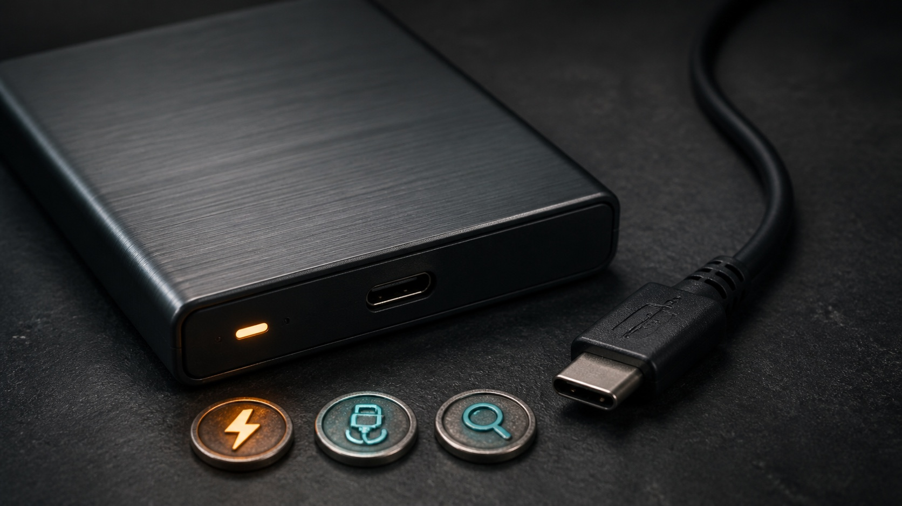
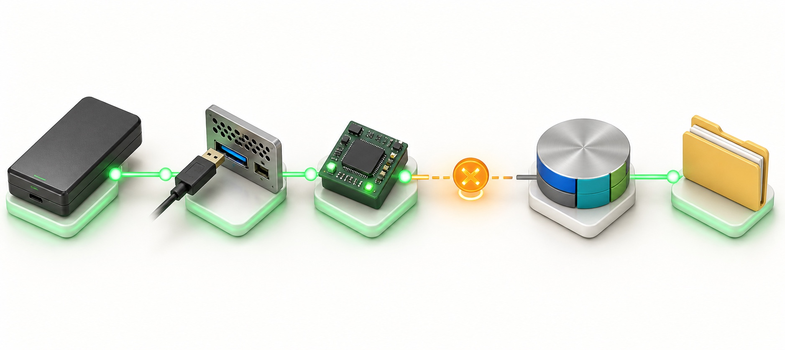

# External Hard Drive Not Showing in Windows 11: Find Where It Disappears

When an external hard drive does not appear in File Explorer, the safest fix depends on **where Windows stops seeing it**. The drive may have no power, fail to connect over USB, appear in Device Manager but not Disk Management, or appear as a healthy volume without a drive letter. Those are different problems. This guide starts with tests that do not change the disk, then explains the few changes that are reasonable only after you identify the correct drive.

## Quick answer

1. If the drive contains important files, do not initialize, format, clean, convert, or repartition it.
2. Disconnect it safely, restart Windows, and reconnect it directly to a different USB port with a known-good cable.
3. Test the drive on another computer. Listen for repeated clicking or spin-up/spin-down cycles.
4. Open **Disk Management** and identify the external disk by capacity, not just by its disk number.
5. If its existing healthy volume has no letter, assign an unused drive letter.
6. If it is **Offline**, bring it Online only after confirming its identity. If it is **Not Initialized**, stop if it has ever stored data.
7. Use Windows Update or the exact PC/drive maker for drivers. Avoid random driver tools and unknown repair software.

## Applies to / Risk / Data loss / Estimated time / Last checked

| Item | Details |
|---|---|
| Applies to | Windows 11 PCs with USB external HDDs or SSDs; most observation steps also apply to Windows 10 |
| Risk level | Medium |
| Data loss risk | Possible |
| Estimated time | 15–40 minutes |
| Last checked | 2026-08-07 |

Back up important files before changing storage settings. If the drive is encrypted, keep the BitLocker recovery key available. On a work or school PC, stop before administrator-only changes and contact IT.

## Step-by-step fixes

1. Protect the data and record the symptom.
2. Prove power, cable, port, and enclosure.
3. Check whether Windows detects a USB storage device.
4. Read the drive's exact state in Disk Management.
5. Assign a missing drive letter only to an existing healthy volume.
6. Use Windows Update and official manufacturer support if the device layer is failing.
7. Reserve driver reinstall and disk repair for a known, backed-up target.

## First, classify the symptom

Do not use “not showing” as the diagnosis. Look for the deepest place where the drive still appears:

- **No light, vibration, sound, or entry in Device Manager:** suspect power, cable, USB port, enclosure, or the drive itself.
- **A USB or disk device appears in Device Manager, but no matching disk appears in Disk Management:** Windows sees part of the hardware path, but the storage device is not presenting a usable disk.
- **The disk appears in Disk Management but not File Explorer:** its volume may be Offline, unallocated, unsupported, damaged, or simply missing a drive letter.
- **The drive appears in File Explorer but will not open:** this is an access, encryption, permission, or file-system problem—not a detection problem.
- **The drive works on another PC:** the original PC's port, USB controller, policy, driver state, or letter assignment is more likely.
- **The drive fails on every PC or repeatedly disconnects:** stop software changes and treat the hardware or enclosure as suspect.

This classification prevents a common mistake: formatting a disk merely because File Explorer did not give it a letter.

## Step 1: Protect existing data before any repair

If this drive has ever held files, assume those files still matter. Cancel any Windows prompt asking you to initialize or format it until you know why the prompt appeared. Microsoft explicitly warns that initializing a disk already in use erases data, and formatting destroys the data on the selected volume.

Do not use **New Simple Volume** on space that unexpectedly became unallocated. Do not run DiskPart `clean`, convert between GPT and MBR, delete a volume, or accept a repair application's “one-click” fix. Do not run commands you do not understand, and copy commands only from official Microsoft documentation. Those actions change disk structures and can turn a diagnosis into a recovery case.

If the drive opens intermittently, copy irreplaceable files to a different physical disk first. Do not move them; copy and verify them. If the drive clicks, grinds, becomes unusually hot, disconnects during copying, or disappears whenever it spins up, stop. Repeated power cycles can worsen some physical failures.

## Step 2: Prove the physical connection

Save open work. If Windows offers the **Safely Remove Hardware and Eject Media** icon, eject the drive and wait for the safe-to-remove message before unplugging it. Microsoft recommends safe removal to reduce the risk of lost or corrupted data.

Then work through one change at a time:

1. Restart the PC with the drive disconnected.
2. Connect the drive directly to the PC rather than through a hub, monitor, dock, keyboard, or front-panel extension.
3. Try another USB port. On a desktop, a rear motherboard port is a useful comparison with a front-panel port.
4. Try a known-good data cable that matches the drive. Some USB-C cables provide power but do not carry the needed data connection reliably.
5. If the enclosure has a separate power adapter, use the correct original or manufacturer-approved adapter and test another wall outlet.
6. Disconnect other nonessential USB devices during the test.
7. Test the drive and cable on another computer.

The result matters more than the act of reconnecting. If another cable fixes it, replace the cable and leave Windows settings alone. If direct connection works but a hub does not, investigate the hub's power and specifications. If the disk fails everywhere, another Windows driver change is unlikely to be the answer.

Use this order to locate the boundary: drive power and enclosure, cable and port, Windows device detection, Disk Management, then File Explorer.

## Step 3: Check Device Manager without deleting anything

Right-click **Start** and open **Device Manager**. Expand **Disk drives** and **Universal Serial Bus controllers**, then connect the external drive and watch for a new entry or a refresh. You are observing first; do not uninstall every USB controller.

If the drive appears by model name under Disk drives, Windows can identify the storage device at the hardware layer. Move to Disk Management. If you see an **Unknown USB Device**, a warning icon, or a Device Manager code, open **Properties** and record the exact code. Microsoft publishes code-specific guidance; do not guess from a generic web page.

Select **Action > Scan for hardware changes** once if the list did not refresh. A normal restart is also safer than repeatedly uninstalling controller devices. If the same external drive works on another PC but never appears here, check Windows Update and the PC maker's official chipset or USB support page later in the process.

## Step 4: Read Disk Management carefully

Right-click **Start > Disk Management**, or press **Windows key + R**, enter `diskmgmt.msc`, and select **OK**. Disk Management is the built-in Windows tool for viewing physical disks, partitions, volume status, file systems, and drive letters.

Find the external drive by its approximate capacity and, when available, model information. Disk numbers can change between computers or after reconnecting hardware. Never assume “Disk 1” is the external drive. Compare the size with the label on the device, and disconnect/reconnect only when no write is in progress to confirm which row appears.

Use the status to choose the next action:

- **Healthy volume with a drive letter:** File Explorer should normally show it. Press **Windows key + E**, then check **This PC**. If it still does not appear, restart Explorer or Windows before changing the disk.
- **Healthy volume with no drive letter:** assigning an unused letter may be appropriate. Follow Step 5.
- **Offline:** right-click the disk label and select **Online** only after verifying the correct disk. If it immediately goes Offline again or reports an error, stop and record the message.
- **Not Initialized:** if it is truly a brand-new empty disk, Microsoft documents initialization. If it has ever stored data, do not initialize it; a damaged signature or hardware problem may be hiding existing structures.
- **Unallocated:** for a brand-new empty drive, creating a volume is normal. For a drive that previously contained files, unexpected unallocated space is a data-recovery warning. Do not create a new volume.
- **RAW, Unknown, Failed, Not Ready, or I/O error:** do not format it to make the warning disappear. Capture the exact state and seek manufacturer or recovery help if the files matter.
- **No matching disk at all:** return to the cable, port, power, enclosure, and another-PC tests. A drive-letter change cannot help a disk Disk Management cannot see.

## Step 5: Assign a missing drive letter safely

This step is only for an **existing, healthy volume** that you positively identified and that has no drive letter. It does not repair an unallocated, RAW, failed, or physically missing disk.

1. In Disk Management, right-click the volume area—not an unrelated system or recovery partition.
2. Select **Change Drive Letter and Paths**.
3. Select **Add**.
4. Choose an unused letter and select **OK**.
5. Open File Explorer and check **This PC**.

Microsoft notes that changing the letter of a drive containing Windows or installed applications can stop apps from finding their files. For an external data volume with no letter, adding an unused letter is different from casually changing a working application's path. If **Change Drive Letter and Paths** is unavailable, the volume may not be ready for a letter; do not force it with a random utility.

## Step 6: Use supported driver sources

Open **Settings > Windows Update > Advanced options > Optional updates** and review any relevant driver updates. Windows Update is Microsoft's normal source for hardware drivers, including external drives. Install only an update that matches the hardware, restart, and retest the same port and cable.

If Windows Update has nothing relevant, use the official support page for the exact PC, motherboard, drive, or enclosure model. Microsoft advises avoiding driver downloads from sites other than the device manufacturer's official site. Do not use a driver-updater bundle, pirated utility, or unknown “disk repair” program.

The Windows release-health hub and Windows message center were checked on 2026-08-07. They provide current, version-specific update context. Their current public notices did not establish a broad external-drive detection incident that replaces local cable, hardware-layer, Disk Management, and drive-letter checks. If your problem began after an update, match any notice to the exact Windows version, KB number, device model, and symptom before blaming the update.

## Advanced Fixes: reinstall only the external disk device

**Warning:** Save work, back up important files, and make sure you can identify the external device by model. Do not uninstall every USB controller, delete driver packages, edit the Registry, flash firmware, initialize the disk, or format it as part of this beginner path.

If the drive works on another PC, appears in Device Manager with a persistent device/driver error, and the physical tests are clean, right-click only that external disk device, select **Uninstall device**, disconnect it, restart Windows, and reconnect it. Microsoft documents that Windows attempts to reinstall a device driver after restart. If the device does not return, use Windows Update or the manufacturer's official package.

Do not run CHKDSK merely because the drive is absent from File Explorer. CHKDSK needs a visible volume and can place stress on a failing disk. If files are important and the disk reports RAW, I/O errors, bad sectors, repeated disconnections, or mechanical noise, obtain a recovery assessment before write-intensive repair.

## What each result means

- **Another cable or port works:** the original connection path was the fault; no partition work is needed.
- **The drive works on another PC only:** focus on the original PC's USB controller, policy, updates, or port hardware.
- **Device Manager sees it but Disk Management does not:** record the model and any device code; the enclosure, bridge, driver, or disk presentation is failing below the volume layer.
- **Disk Management shows a healthy volume without a letter:** adding an unused letter is the narrow fix.
- **Disk Management shows Not Initialized or Unallocated on a used drive:** stop; do not initialize or create a volume if the files matter.
- **The drive repeatedly disconnects, clicks, or fails on multiple PCs:** stop software troubleshooting and seek hardware or recovery help.

## When to stop and get help

Stop and contact the drive maker, PC maker, IT administrator, or a reputable data-recovery professional when:

- The drive contains the only copy of important files.
- You hear clicking, grinding, repeated spin-up cycles, or the drive becomes unusually hot.
- The drive asks for a BitLocker recovery key you do not have.
- A previously used disk suddenly appears as Not Initialized, Unallocated, RAW, Unknown, or Failed.
- Windows reports I/O errors or the drive disconnects during copying.
- The enclosure or connector is loose, burned, split, or physically damaged.
- This is a managed work or school device.

## FAQ

### Why is my external hard drive visible in Disk Management but not File Explorer?

The disk may have an existing volume without a drive letter, be Offline, use an unsupported or damaged file system, or be unallocated. Read the exact Disk Management state before changing anything.

### Should I initialize a drive when Windows asks?

Only when you are certain it is a new, empty disk. Microsoft warns that initialization erases data on a disk already in use. Cancel the prompt for any drive that previously stored files.

### Will assigning a drive letter erase files?

Adding a letter to a correctly identified existing healthy volume does not format it. The danger is selecting the wrong volume or using the step on an unhealthy disk. Confirm the drive by capacity and status first.

### Why does the drive work on one computer but not another?

The failing computer may have a weak or damaged port, insufficient hub power, a USB-controller issue, a policy restriction, or a conflicting letter assignment. The successful test also shows that immediate formatting or replacement is unnecessary.

### Is it safe to uninstall the external drive in Device Manager?

It can be reasonable only after physical tests, with readable files backed up, and when you select the exact external device. Restart lets Windows attempt to reinstall it. Do not mass-uninstall USB controllers.

### Should I run CHKDSK on a missing external drive?

No. A drive that Windows cannot present as a volume cannot be fixed by a drive-letter CHKDSK command. On a failing disk, repair writes can also complicate recovery. Diagnose visibility and hardware health first.

### Can a USB hub cause an external drive to disappear?

Yes. A hub, dock, long extension, or underpowered port can fail to deliver stable power or data. Test the drive directly on the computer with a known-good cable.

### Should I install a third-party partition or driver tool?

Not for this first-line diagnosis. Use Disk Management, Windows Update, and the exact manufacturer's official support. Unknown tools can change partitions or install the wrong driver.

## Related guides

- [USB Device Not Recognized in Windows 11: Identify the Port, Cable, or Driver Boundary](https://easypcfixguide.blogspot.com/2026/07/usb-device-not-recognized-in-windows-11.html)
- [File Explorer Keeps Freezing: Test Quick Access, Folders, and Extensions](https://easypcfixguide.blogspot.com/2026/07/file-explorer-keeps-freezing-on-windows.html)
- [Free Up Windows Disk Space Without Deleting Personal Files](https://easypcfixguide.blogspot.com/2026/07/how-to-free-up-disk-space-on-windows.html)

## Official sources

- [Microsoft Support: Disk Management in Windows](https://support.microsoft.com/en-US/Windows/Experience/Storage-FileManagement/disk-management-in-windows)
- [Microsoft Learn: Change a drive letter](https://learn.microsoft.com/en-us/windows-server/storage/disk-management/change-a-drive-letter)
- [Microsoft Learn: Initialize new disks](https://learn.microsoft.com/en-us/windows-server/storage/disk-management/initialize-new-disks)
- [Microsoft Support: Safely remove hardware in Windows](https://support.microsoft.com/en-US/Windows/Hardware/safely-remove-hardware-in-windows)
- [Microsoft Support: Automatically get recommended and updated hardware drivers](https://support.microsoft.com/en-US/Windows/Hardware/Drivers/automatically-get-recommended-and-updated-hardware-drivers)
- [Microsoft Support: Update drivers through Device Manager in Windows](https://support.microsoft.com/en-us/windows/update-drivers-through-device-manager-in-windows-ec62f46c-ff14-c91d-eead-d7126dc1f7b6)
- [Microsoft Support: Error codes in Device Manager in Windows](https://support.microsoft.com/en-US/Windows/Hardware/Drivers/error-codes-in-device-manager-in-windows)
- [Microsoft Learn: Windows release health](https://learn.microsoft.com/en-us/windows/release-health/)
- [Microsoft Learn: Windows message center](https://learn.microsoft.com/en-us/windows/release-health/windows-message-center)

## Final summary

An external drive missing from File Explorer is not automatically empty or broken. First protect the data, prove the power/cable/port path, observe Device Manager, and read the exact Disk Management state. Assign a letter only to a known healthy volume, and never initialize or format a used drive just to make it appear. The point is to find where the drive disappears while making the fewest possible changes.
