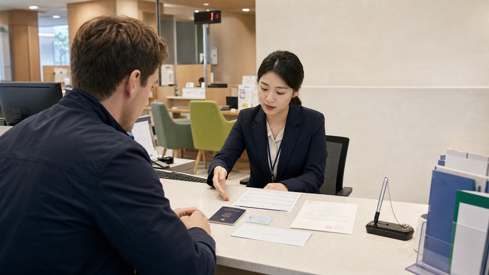
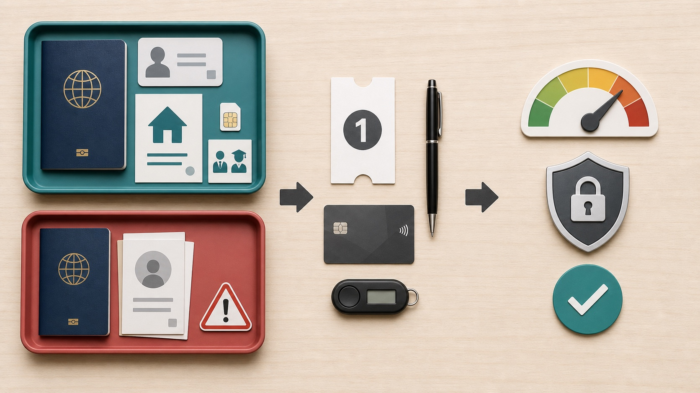

# How to Open a Bank Account in Korea as a Foreigner

Opening a bank account in Korea is usually realistic for a registered foreign resident, but it is not a guaranteed walk-in service for every visitor. The branch must verify your identity and may ask why you need the account. A residence card, Korean address, Korean phone number in your name, and proof of employment or study make the process much smoother. A passport-only application can be possible at some banks or branches, but it is more likely to receive extra checks, limited services, or a refusal.

The best practical strategy is to call a branch with foreign-language support, ask for its current document list, and bring more evidence than the minimum. Do not choose a bank only because its app looks convenient. First confirm that the branch can open the account, issue a debit/check card, enroll you in mobile banking, and set transfer limits that fit your rent, salary, tuition, or daily-payment needs.

## Quick Answer

| Your situation | Best approach |
|---|---|
| You have a residence card, Korean address, and local phone | Book or visit a foreigner-friendly branch with proof of work, study, or another clear transaction purpose. |
| You are waiting for your residence card | Ask whether the branch accepts a passport now and can update the account later; expect stricter limits or a second visit. |
| You are a short-term tourist | Do not assume you can open a normal resident account. Use an overseas card, cash, or a tourist payment product instead. |
| You need salary or scholarship deposits | Bring the employment contract, company certificate, school enrollment letter, or scholarship document showing why the account is needed. |
| You need to send money abroad | Ask about foreign-remittance enrollment, required supporting documents, exchange rates, and fees before choosing the bank. |

## Who Can Usually Open an Account?

Korean banks conduct real-name and customer-verification checks. The Financial Supervisory Service's foreigner guide explains that a passport or foreigner residence card can be used as identification, but the branch may request other documents to verify identity and transaction purpose. Woori Bank's current foreign-customer page similarly says to bring a passport or residence card and warns that employment proof, pay records, income proof, utility bills, or other documents may be requested.

In practice, a long-term resident with a residence card has the clearest path. Employees, students, spouses, and other registered residents can normally explain a concrete use such as salary, tuition, rent, utilities, or everyday spending. A tourist asking for an account without a Korean address or continuing relationship may not satisfy the branch's checks. Bank policy, visa status, nationality-related compliance checks, and the individual product can all affect the decision.

Korea introduced mobile foreigner residence cards in 2025. The Financial Services Commission announced that registered foreign residents could use the mobile card for in-person account opening at an initial group of six banks, with expansion planned. Acceptance has broadened, but implementation can still differ by bank and branch. Carry the physical card and passport when possible instead of relying on the mobile credential alone.

## Documents to Prepare

Bring original documents, not only phone photos. A branch may copy them and may reject an expired or damaged ID.

- Passport with the same English name you use for immigration, your phone account, employer, and school.
- Physical foreigner residence card. If your bank confirms it accepts the mobile foreigner residence card, keep the physical card as backup.
- Proof of Korean address, such as a housing contract, residence confirmation, recent utility bill, dormitory confirmation, or employer-provided housing letter.
- Korean mobile number registered in your own name. This is important for app enrollment, identity checks, alerts, and some online payments.
- Proof of transaction purpose: employment contract, certificate of employment, pay statement, student enrollment certificate, scholarship letter, tuition notice, or another document tied to the account's intended use.
- Korean tax or identification information the bank requests. Do not guess; answer the bank's tax-residency and foreign-tax questions accurately.
- A small initial deposit if the product requires it. Many basic accounts can be opened with little or no starting balance, but product terms vary.

If your passport name and residence-card name are displayed differently, ask the branch which spelling it will register. Name mismatches can later break salary deposits, phone verification, card enrollment, or international transfers.

The visual separates the strong resident-document path from the more uncertain passport-only path. Both end with a branch visit, but only the bank can decide which products and limits it will approve.

## Step-by-Step Guide at the Branch

1. **Choose a practical branch.** Look for a branch near your home, workplace, or university that offers English or another language you use. A convenient branch matters because ID updates, limit changes, lost cards, and account closure may require another visit.
2. **Call before traveling.** Ask whether it opens accounts for your visa or residence status, which original documents are required, whether a reservation is needed, and whether mobile banking and a debit/check card can be issued on the same day.
3. **Arrive during bank hours with time to spare.** Many Korean branches operate on weekdays around 9:00-16:00, but confirm the specific branch. Account opening can take longer than a simple cash transaction.
4. **State one clear purpose.** Say, for example, "I need an account for salary and rent" or "I am a student receiving living expenses and paying tuition." Vague answers make the compliance review harder.
5. **Complete identity and tax-residency forms.** Use the same English spelling across all forms. Read declarations carefully, especially questions about foreign tax residence, beneficial ownership, and expected transactions.
6. **Select a basic deposit account.** Ask whether it is covered by deposit insurance and whether there is a monthly maintenance fee, minimum balance, or fee-waiver condition.
7. **Request the services you actually need.** These may include a bankbook, cash card, domestic debit/check card, mobile and internet banking, English notifications, overseas ATM use, or foreign remittance.
8. **Register a secure PIN and app access.** Do not use your birth date, phone number, repeated digits, or an obvious sequence. Never let a stranger "help" by learning your PIN or security code.
9. **Check transaction limits before leaving.** Ask for the daily and per-transaction limits for branch, ATM, mobile transfer, online transfer, and overseas use. A newly opened or purpose-limited account may not support a large housing deposit or tuition transfer.
10. **Test the account safely.** Make a small deposit, confirm your English name, log in to the official app, and verify that alerts arrive. Keep the account-opening documents until everything works.

## Restricted Accounts and Transfer Limits

Korean banks may restrict a new account when the transaction purpose has not been fully verified or fraud-prevention controls require a lower-risk setup. The exact restriction is bank-specific. It may affect ATM withdrawals, online transfers, mobile banking, or the amount you can move each day.

Do not accept a vague statement that the account is "limited." Ask the teller to write down or show you:

- the limit for each channel;
- whether the limit is per transaction or per day;
- which document can raise it;
- whether salary deposits or a period of normal use are required;
- whether the change must be requested at the original branch; and
- whether rent, tuition, or a housing deposit can be handled at a branch even if the app limit is lower.

Never invent a job, salary, or payment purpose to obtain a higher limit. Bring the genuine contract or invoice and let the bank explain the correct route.

## Fees, Cards, Mobile Banking, and Deposit Protection

Opening a basic account itself is often free, but using it is not always free. Compare ATM fees outside the bank's network, transfer fees, replacement-card fees, overseas card settings, foreign-currency conversion, and international remittance charges. Salary or student products may waive some fees only after a qualifying deposit or automatic payment.

A Korean **check card** is a debit card that normally spends from the available account balance. Ask whether it supports online payments, post-paid public transportation, and overseas use; these features are not automatic. A credit card is a separate credit decision and usually needs stronger income and residence evidence.

Set up the bank's official mobile app at the branch if possible. Confirm the app publisher and download link from the bank's website, not from a message or advertisement. Ask whether you need a security card, OTP token, digital certificate, or additional identity step. If you change your Korean phone number or renew your residence card, update the bank promptly.

Deposit protection information on some older bank pages is outdated. The Financial Services Commission states that, from September 1, 2025, eligible deposits at KDIC-covered institutions are protected up to **KRW 100 million per depositor per institution**, including applicable principal and interest. Not every financial product is protected; market-performance-linked funds are an example of an unprotected product. Check the product's current deposit-insurance notice rather than assuming every balance has the same coverage.

## Closing, Cancellation, and Moving Money Out

A deposit account is not a ticket purchase, so there is usually no "refund" of an opening fee. To close it, you receive or transfer the remaining eligible balance after pending transactions, fees, and legal holds are handled. The bank may require an in-person visit with the ID used at opening, the bankbook if one was issued, and your registered signature or seal.

Before leaving Korea, do not close the account too early. Wait until your last salary, utility adjustment, tax settlement, housing-deposit return, and card charge have cleared. Then:

1. cancel automatic payments and subscriptions;
2. download statements you may need for tax or employment records;
3. settle card and transfer fees;
4. move the balance through an authorized remittance route;
5. close or keep the account only after asking what happens when your visa, phone number, and address expire.

International remittance rules and supporting-document requirements depend on the amount, purpose, tax status, and bank. Ask the bank for a written fee and exchange-rate explanation before transferring a large balance.

## Foreigner-Specific Blockers and Fixes

- **Passport-only application is refused:** wait for the residence card or try a branch that confirms passport-based opening for your status. A different branch is not a guarantee.
- **Phone verification fails:** confirm the Korean SIM is registered under the exact same name and identity number the bank uses.
- **Names do not match:** bring the passport and residence card and ask the bank and carrier to align their records.
- **The app has limited English:** complete enrollment with staff, save the foreign-language call-center number, and learn the Korean labels for transfer, balance, and card lock.
- **The account limit is too low:** present genuine salary, tuition, rent, or contract evidence and request a formal review.
- **A card or OTP does not arrive:** verify the registered address and whether pickup is at the branch or by delivery.
- **A "helper" asks to borrow the account:** refuse. Woori Bank specifically warns that lending an account or card to another person can lead to punishment. Account rental is a common pathway for fraud.

## Safer Alternatives for Short Stays

If you are visiting for a few weeks, a Korean bank account may add more setup than value. Keep at least two internationally enabled cards, notify your issuers about travel, and carry a modest cash backup. A tourist-oriented prepaid product can be useful, but compare load, withdrawal, refund, and remaining-balance rules.

For cash access, use bank-operated or clearly marked global ATMs and review the displayed fee before confirming. For local app payments, remember that a Korean account alone may not solve Korean-phone or identity-verification requirements. Read the related payment and ATM guides below before depending on a single method.

## Common Mistakes

- Visiting with only a passport photo instead of original identification.
- Saying "personal use" without documents showing salary, school, rent, or another real purpose.
- Leaving without checking mobile-transfer and ATM limits.
- Assuming a debit/check card automatically supports overseas use or post-paid transit.
- Using an app-store link sent by a stranger instead of the bank's official site.
- Relying on an old KRW 50 million deposit-protection statement after the 2025 increase.
- Closing the account before the final salary, rent deposit, tax payment, or card charge clears.

## FAQ

### Can a tourist open a Korean bank account?

Possibly at some banks or branches, but do not plan around it. A passport-only applicant without a Korean address, phone, or continuing transaction purpose faces more checks and may be refused or offered limited services.

### Is a residence card mandatory?

Bank guidance recognizes a passport or residence card as identification, but a residence card is the stronger practical route for resident services. Individual banks may require it for the product, app, card, or limit you want.

### How much does it cost to open an account?

Basic account opening is often free, but card issuance, replacement, ATM use, transfers, remittance, or particular products can have fees. Ask for the current fee schedule.

### Can I open the account completely online?

Some banks offer non-face-to-face services to eligible foreign residents, and Korea has expanded digital ID verification. Eligibility differs by bank, identity credential, phone ownership, residence status, and app. A branch visit remains the most reliable first route.

### Will I receive a debit card immediately?

Some branches can issue or arrange a check/debit card during account opening; others mail it or require another step. Confirm online, overseas, and transportation functions separately.

### Why is my new account transfer limit low?

The bank may have opened a purpose-limited or fraud-prevention account. Ask exactly which limits apply and which genuine documents or account history are needed for review.

### Is my money protected if the bank fails?

Eligible deposits at KDIC-covered institutions are protected up to KRW 100 million per depositor per institution under the limit effective September 1, 2025. Confirm that the specific product is covered.

### Can I keep the account after leaving Korea?

Sometimes, but your bank may need updated residence, tax, phone, and address information, and services can be restricted after documents expire. Ask before departure and keep a secure way to receive bank notices.

## Related Guides

- [Korea Mobile Payment Options for Foreigners](https://koreaeasyguide.blogspot.com/2026/07/korea-mobile-payment-options-for.html)
- [Korea ATM Withdrawal Guide for Foreigners](https://koreaeasyguide.blogspot.com/2026/07/korea-atm-withdrawal-guide-for.html)
- [Korea Cash vs Card Guide for Tourists](https://koreaeasyguide.blogspot.com/2026/07/korea-cash-vs-card-guide-for-tourists.html)

## Official Sources

- [Woori Bank: Banking Guide for Foreign Customers](https://spib.wooribank.com/pib/Dream?withyou=ENENG0688)
- [Financial Services Commission: Mobile Foreigner Residence Card for Account Opening](https://www.fsc.go.kr/eng/pr010101/84215)
- [Seoul Foreign Portal: Mobile Foreigner Residence Card Issuance](https://global.seoul.go.kr/web/news/senw/bordContDetail.do?brd_no=5&lang=ko&mode=W&post_no=2B514F3675690198E063C0A8A0232FDC)
- [Financial Services Commission: KRW 100 Million Deposit Protection](https://www.fsc.go.kr/eng/pr010101/84977)
- [Seoul Foreign Portal: Financial Guide Book for Foreigners](https://global.seoul.go.kr/web/news/libr/bordContDetail.do?brd_no=9&lang=en&mode=W&post_no=F413CFA15F65011CE053C0A8A0239B3B)
- [Financial Transactions Guide for Foreigners in Korea](https://img.shinhan.com/nexhpe/ko/news/201001280441159_1264643513000000173.pdf)

## Final Summary

For a foreign resident, the safest path is an in-person visit with a passport, residence card, Korean address, local phone, and clear proof of why the account is needed. Ask about the account, check card, mobile banking, remittance, fees, and every transfer limit before leaving. Passport-only opening and online opening can be possible, but neither is universal. Verify the branch's current rules, protect your credentials, and never lend the account to someone else.
