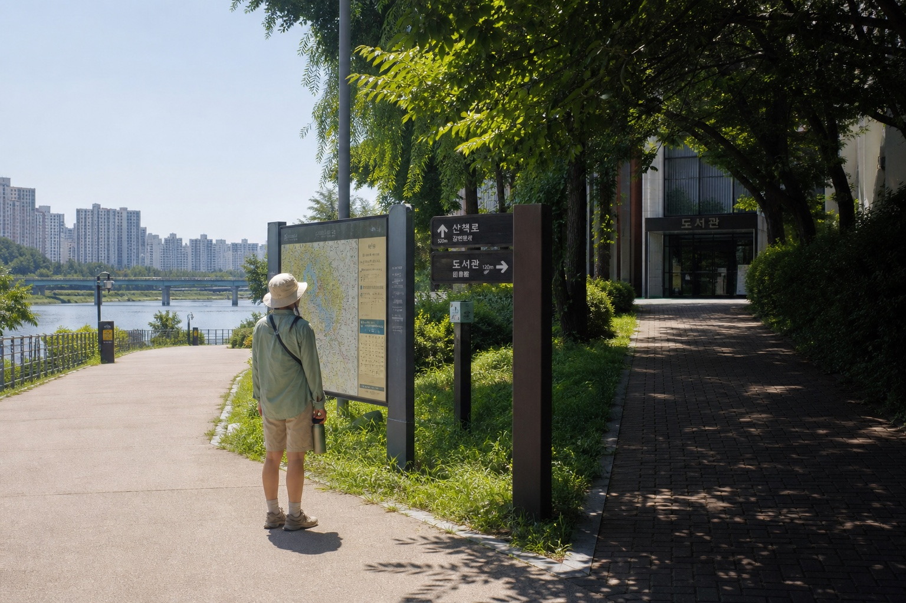
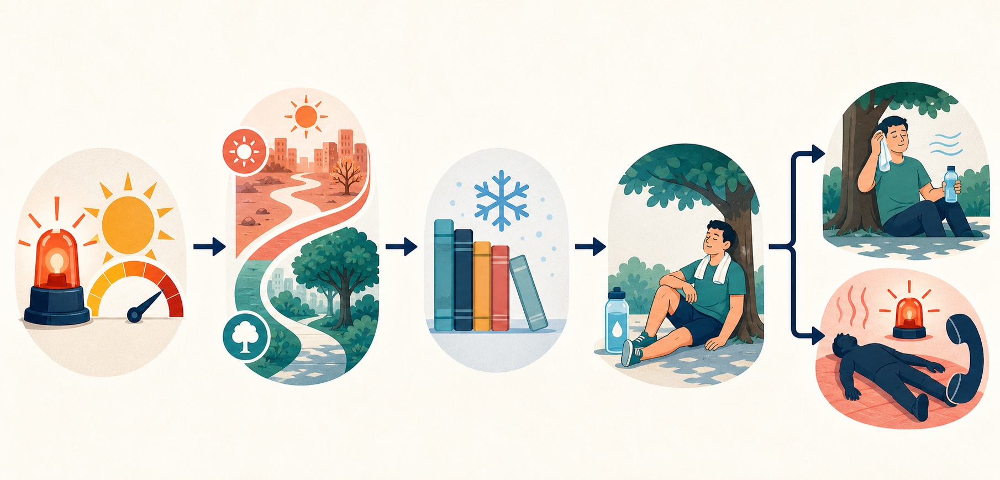

# Korea Heatwave Travel Safety: A Practical Plan for Foreign Visitors

A Korea heatwave changes more than what you should wear. It changes when to walk, which attractions to group together, how much transfer time to allow, and when an outdoor plan should become an indoor one. The safest response is not automatically to cancel an entire trip. Check the official warning for the exact city, move long walks out of the hottest hours, build cooling stops into the route, carry water, and know the signs that require immediate medical help.

Korea's summer is hot and humid, and the Korea Tourism Organization says August is normally the hottest month. Humidity matters because air temperature alone does not describe how hard the heat feels. Korea Meteorological Administration (KMA) heat information uses apparent temperature and impact-based risk levels. A forecast that looks manageable in a generic app can feel much harder on a paved palace courtyard, an exposed coastal trail, or a long station transfer.

This guide is for travelers and newly arrived residents who need a decision plan rather than another packing list. It does not replace medical care. If a person is confused, unconscious, having a seizure, or otherwise appears seriously ill in the heat, call **119** and start cooling them while help is coming.

## Quick Answer: Keep the Trip, Rebuild the Day

| Situation | Safer decision |
|---|---|
| No alert, but the afternoon feels oppressive | Keep the plan, shorten exposed walks, and add an indoor stop every 60–90 minutes. |
| Heatwave watch or elevated impact forecast | Move palaces, markets, hikes, and neighborhood walks to early morning or evening. |
| Heatwave warning or repeated local alerts | Drop nonessential midday outdoor activity and use air-conditioned transport. |
| Dizziness, nausea, headache, cramps, weakness, or heavy sweating | Stop, enter a cool place, loosen clothing, cool the body, and take fluids slowly only if fully conscious. |
| Confusion, collapse, seizure, or loss of consciousness | Call 119, cool the person immediately, and never give a drink to someone who is not fully conscious. |

Check the [KMA current severe weather page](https://www.weather.go.kr/neng/forecast/warning.do) in the morning and again before a long outdoor block. Compare it with local messages on [Safe Korea's English emergency-alert page](https://eng.safekorea.go.kr/safekorea-eng/ctim/cmsg/calamitySms.do?menuSn=1005&smsLang=en). Local governments often give practical instructions about afternoon activity, water, shade, rest, and emergency calls.

## Before You Start: Understand the Alert

KMA's English impact-based heatwave leaflet explains four color-coded risk levels and uses apparent temperature. For outdoor-work guidance, it shows attention from 31°C for two or more days, caution from 33°C for two or more days, warning from 35°C for two or more days, and danger from 38°C for one or more days. Those figures provide orientation, but travelers should follow the current location-specific alert rather than calculating their own category.

Check three layers:

1. **National warning:** KMA shows severe-weather status and impact forecasts.
2. **Local instruction:** Safe Korea republishes municipal emergency messages. Its English text can be machine translated, so verify anything unclear through 1330 or local staff.
3. **Your route:** shade, stairs, queues, luggage, age, health, and humidity can make the same forecast much harder for one traveler than another.

Foreign visitors may not receive every location-based alert. A roaming SIM, data-only eSIM, disabled notifications, or a phone bought outside Korea can change what appears. The absence of a phone alert is not proof that there is no warning. Bookmark the official pages and ask accommodation staff about the local status.

People with chronic medical conditions should follow their clinician's advice about heat and fluid intake. Korean public-health guidance recommends regular water for most people, but someone whose doctor has limited fluids should not override that instruction based on a travel guide.

## Step-by-Step Guide for a Heatwave Day

### 1. Check the city and the hours that matter

Look up the place you will actually visit, not only "Korea" or "Seoul." Conditions can differ between Seoul, Busan, Jeju, inland cities, and mountain areas. Note the apparent temperature, warning level, humidity, and hottest hours. Recheck before a hike, beach visit, festival, cycling route, or long outdoor queue.

KMA heat guidance centers **water, shade, and rest** and advises avoiding outdoor work during the hottest period, commonly 2 p.m. to 5 p.m. Sightseers should use a broad buffer when the alert is strong: finish the most exposed walking before lunch, stay indoors through midafternoon, and resume only after checking again.

### 2. Split one ambitious route into safe blocks

A normal itinerary might combine a palace, outdoor market, hillside neighborhood, and river walk. During a heatwave, that creates hours of accumulated exposure. Keep one outdoor anchor and surround it with indoor recovery stops.

A safer pattern is an early palace or park, a late-morning museum, a long indoor lunch or library break, one flexible late-afternoon stop, and an evening market only if the alert and your condition allow it. Waiting for a bus, standing in a ticket queue, crossing a wide plaza, and transferring without seating also add heat load. Add margin instead of booking consecutive timed entries.

### 3. Mark two cooling stops before leaving

Identify at least two places where you can sit in air conditioning without a complex reservation. Museums, department stores, major stations, public libraries, and some community facilities are practical. Do not assume every cafe welcomes a long rest without an order, or that every small shop has seating.

Seoul's current **2026 COOL Library** program runs at 223 libraries in all 25 districts during July and August. The [Seoul Metropolitan Government announcement](https://english.seoul.go.kr/cool-off-at-the-library-this-summer-with-seouls-cool-library-campaign-across-223-libraries/) links to individual schedules. Hours vary, so verify before traveling. Seoul has also used marked convenience-store climate shelters, but locations can change; look for the shelter sign and do not assume every branch participates.

Public cooling spaces are generally a no-admission-cost option, but a museum, cafe, transit ride, or attraction can charge its normal price. Keep a payment card and cash backup instead of depending on one app during a detour.

### 4. Carry a small heat kit, not a heavy bag

Carry water, a brimmed hat or umbrella, sunscreen, a small towel, and personally required medicine. Wear light, loose clothing and breathable shoes. A frozen bottle helps only briefly; shade and seating may be the real constraint.

Heavy shopping bags and luggage make station stairs and outdoor transfers harder. Use a locker or return to the accommodation before the hottest hours. With children or older adults, let their pace set the schedule and check on them before they say they are thirsty.

### 5. Drink regularly and use cooling as a planned stop

Drink water regularly rather than waiting for intense thirst. Alcohol can make a heat-risk day worse, and too much caffeine can displace the water and rest you need. After prolonged heavy sweating, food and an appropriate electrolyte drink may help, but supplements never replace cooling or medical care.

Sit down, cool off, and reassess before starting another strenuous activity. If symptoms continue despite rest and cooling, get medical help.

### 6. Change or cancel the right part

Postpone exposed activities first: midday hikes, long cycling routes, roofless tours, outdoor queues, and distant beach transfers without shade. Indoor reservations may still work. A heatwave warning does **not** create a universal refund right. Cancellation, no-show, and weather-refund rules belong to the attraction, tour company, rail operator, airline, or booking platform.

Before the free-cancellation deadline, check the operator's official notice and save any heat-related closure. Ask for written confirmation when staff cancel a service. If it stays open but you decide not to go, normal voluntary-cancellation fees may apply.

### 7. Recheck after sunset

A tropical night can prevent recovery. Safe Korea messages may advise keeping the room cool, drinking water before sleep, and checking on vulnerable people. Confirm the accommodation air conditioner works before reception closes. Learn the wall controller and ask about timers or central operating hours. If the room cannot be cooled safely, contact the host or booking platform while the issue can be documented.

Use the flow as a pre-departure check: official alert first, then route timing, cooling stops, hydration and rest, and finally the emergency threshold.

## Heat Illness: When Rest Is Not Enough

Korea Disease Control and Prevention Agency (KDCA) guidance separates several heat-related illnesses. Heat exhaustion commonly involves heavy sweating, weakness, pale or cool clammy skin, nausea, vomiting, dizziness, or cramps. Heat stroke is more dangerous and can involve altered consciousness, confusion, seizure, collapse, and very high body temperature.

For a conscious person with milder symptoms, stop the activity, move them to air conditioning or shade, loosen unnecessary clothing, and cool the skin with water, a wet towel, fan, or cold packs at the neck, armpits, and groin. Offer water slowly only if the person is fully conscious and can swallow. Seek help if symptoms do not improve promptly or you are uncertain.

For confusion, loss of consciousness, seizure, collapse, or suspected heat stroke, call **119 immediately**. Continue active cooling while waiting. KDCA warns not to give a drink to an unconscious person because of choking risk. The [KDCA 2026 guidance](https://www.kdca.go.kr/kdca/2848/subview.do?enc=Zm5jdDF8QEB8JTJGa2RjYSUyRjQyJTJGMzExNjE2JTJGYXJ0Y2xWaWV3LmRvJTNG) emphasizes altered consciousness and rapid cooling.

The [VISITKOREA emergency guide](https://english.visitkorea.or.kr/svc/contents/contentsView.do?vcontsId=140042) lists 119 for medical emergencies, 1339 for infectious-disease emergencies, and 1330 for multilingual travel help. 1330 can assist with language and travel orientation, but it does not replace 119 when someone is seriously ill.

## Foreigner-Specific Problems and Fixes

- **The alert is only in Korean:** translate the plain text, then verify the city, time, and instruction on Safe Korea. Do not follow links in unsolicited messages.
- **A cooling-shelter search fails:** search `무더위쉼터` or use the facility's exact Korean name. Ask 1330, Seoul 120, or accommodation staff to confirm.
- **Your eSIM receives no alert:** use KMA and Safe Korea directly. Data service and emergency-message delivery are different functions.
- **Pharmacy communication is difficult:** show allergies, current medicines, and symptoms clearly. For worsening symptoms, use a clinic or hospital rather than trying several products.
- **Tickets are prepaid:** keep the essential reservation, remove optional outdoor stops, and check the operator's official change rules before paying a third party.
- **The room controller is unfamiliar:** ask for a demonstration before bedtime and document a cooling failure promptly.
- **You travel alone:** share the route, carry the accommodation address in Korean, and avoid remote hikes during a high alert.

## Mistakes That Make a Hot Day Worse

- Looking only at the high temperature and ignoring humidity, apparent temperature, and alerts.
- Starting a hike or exposed neighborhood walk at noon because the sky is clear.
- Treating a cafe purchase as the only cooling plan when seating may be full.
- Carrying shopping bags all afternoon instead of using a locker.
- Drinking alcohol at lunch and assuming one sports drink corrects the risk.
- Giving water to someone who is confused or unconscious.
- Assuming every train, attraction, or tour is canceled and refundable.
- Depending on one translation app, battery, payment method, or data connection.

## Better Indoor and Evening Alternatives

Replace a palace-to-palace walking day with one palace at opening time and a museum afterward. Replace a mountain hike with a short shaded park loop. Replace a midday market circuit with a food hall or evening visit. Replace an exposed bus transfer with subway or taxi travel when the waiting environment is the real risk.

For Busan, Jeju, or another coastal destination, do not assume sea breeze makes every plan safe. Beaches add reflected sun and limited shade, and water activity can hide dehydration. Check local warnings, lifeguard instructions, and typhoon or heavy-rain information alongside heat risk.

## FAQ

### What temperature counts as a heatwave warning in Korea?

KMA uses apparent temperature and impact-based criteria, not one universal number for every decision. Use the current alert for the exact area instead of applying a remembered threshold yourself.

### Will my foreign phone receive Korean emergency alerts?

It may, but delivery depends on the device, SIM, roaming setup, settings, and network. A missing alert does not confirm safety. Check KMA and Safe Korea manually.

### Are cooling shelters free for tourists?

Public cooling spaces are generally intended as accessible relief, but eligibility, hours, seating, and locations vary. Seoul's 2026 COOL Library sites have individual schedules and rules.

### Should I drink an electrolyte beverage instead of water?

Water is the basic choice for routine hydration. After prolonged heavy sweating, food or an appropriate electrolyte drink may help. People with fluid or salt restrictions should follow professional advice.

### Can I get a refund because of a heatwave warning?

Not automatically. The operator's policy and whether the service was actually canceled determine the outcome. Check the official notice before the deadline.

### What number should I call for heat stroke in Korea?

Call 119. Move the person to a cool place and start cooling while help comes. Never give a drink to someone who is not fully conscious.

### Can 1330 arrange medical help in English?

1330 provides multilingual travel assistance and orientation. For a serious or worsening medical emergency, call 119 directly.

### Is an early-morning hike always safe during a heatwave?

No. Check the warning, humidity, route shade, water access, distance, and your health. Avoid remote or strenuous routes when risk is high.

## Related Guides

- [Korea Weather and Packing Guide by Season](https://koreaeasyguide.blogspot.com/2026/07/korea-weather-and-packing-guide-by.html)
- [Korea Hospital and Pharmacy Guide for Foreigners](https://koreaeasyguide.blogspot.com/2026/07/korea-hospital-and-pharmacy-guide-for.html)
- [Korea Cafe Etiquette for Tourists](https://koreaeasyguide.blogspot.com/2026/07/korea-cafe-etiquette-for-tourists.html)
- [Late Night Transportation in Seoul](https://koreaeasyguide.blogspot.com/2026/07/late-night-transportation-in-seoul.html)

## Official Sources

- [KMA: Current Severe Weather Status](https://www.weather.go.kr/neng/forecast/warning.do)
- [KMA: Impact-Based Heat Wave Forecasting Leaflet](https://www.weather.go.kr/wnuri_help/doc/heatwave_leaflet_eng.pdf)
- [Safe Korea: English Emergency Alerts](https://eng.safekorea.go.kr/safekorea-eng/ctim/cmsg/calamitySms.do?menuSn=1005&smsLang=en)
- [KDCA: Heat Illness Prevention and First Aid](https://health.kdca.go.kr/healthinfo/biz/health/ntcnInfo/healthSourc/thtimtCntnts/thtimtCntntsView.do?thtimt_cntnts_sn=122)
- [KDCA: 2026 Heat-Stroke Guidance](https://www.kdca.go.kr/kdca/2848/subview.do?enc=Zm5jdDF8QEB8JTJGa2RjYSUyRjQyJTJGMzExNjE2JTJGYXJ0Y2xWaWV3LmRvJTNG)
- [VISITKOREA: Climate](https://english.visitkorea.or.kr/svc/contents/infoBscView.do?vcontsId=140636)
- [VISITKOREA: Emergency Situations](https://english.visitkorea.or.kr/svc/contents/contentsView.do?vcontsId=140042)
- [Seoul: 2026 COOL Library Program](https://english.seoul.go.kr/cool-off-at-the-library-this-summer-with-seouls-cool-library-campaign-across-223-libraries/)

## Final Summary

During a Korea heatwave, keep the parts of the trip that remain safe and rebuild the exposed hours. Check KMA and Safe Korea, move long walks to morning or evening, mark cooling stops, carry water without overloading your bag, and treat persistent symptoms seriously. Know 119 for emergencies and 1330 for multilingual travel help. A strong plan has a shaded route, an indoor alternative, a clear cancellation check, and permission to stop before the schedule becomes a health risk.
